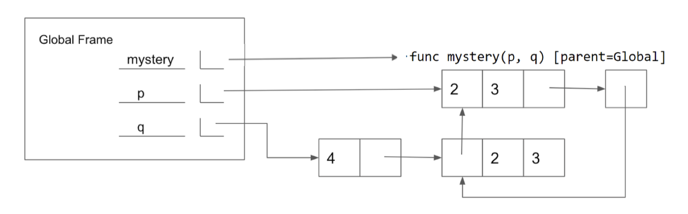

## 1 Nonlocal

### 场景用途

可以访问（access）父栈帧中的 names，但是不可以更改他们

nonlocal 可以修改父栈帧 name 绑定（重新绑定值）


### 注意

- nonlocal 声明变量，其父栈帧不能是 global frame
- 当前作用域中的名称不能使用 `nonlocal` 关键字进行覆盖。这意味着在同一个作用域（frame）中，不能同时存在**局部变量（local binding）**和**非局部变量（nonlocal binding）**具有相同的名称。


### 可变函数（mutable functions）

由于 `nonlocal` 允许修改父作用域中的变量绑定，我们称使用 `nonlocal` 的函数为**可变函数（mutable functions）**。


## Questions

### 1.1 ✅

编写一个函数，该函数接受一个数字 `n` 并返回一个**单参数函数**。

返回的函数接收一个**用于更新 `n` 的函数**，并返回更新后的 `n`。

```python
def memory(n):
  def f(g):
    nonlocal n
    n = g(n)
    return n
  return f
```


## 2 Mutation

我们可以通过**列表变异（list mutation）\**来解决这个问题。在 Python 中，一些对象（如\**列表**和**字典**）是**可变的（mutable）**，这意味着它们的内容或状态可以在程序执行过程中更改。而其他对象（如**数值类型**、**元组（tuple）\**和\**字符串（string）**）是**不可变的（immutable）**，即它们在创建后无法更改。

因此，与其构建一个新的披萨，我们可以直接**修改（mutate）**现有的披萨，给它加上一些洋葱！


`append` 是一种**方法（method）**，也就是**属于某个对象的函数**，因此我们需要使用**点符号（dot notation）\**来调用它。我们将在课程的后续部分更详细地讨论方法，但目前，你可以先了解以下几种常见的\**列表变异（list mutation）方法**：

1. **`append(el)`**：将 `el` 添加到列表的末尾，**返回 `None`**。
2. **`extend(lst)`**：将 `lst` 中的元素拼接到当前列表的末尾，**返回 `None`**。
3. **`insert(i, el)`**：在索引 `i` 处插入 `el`（**不会替换原有元素，而是新增一个元素**），**返回 `None`**。
4. **`remove(el)`**：移除列表中**第一次出现**的 `el`，如果 `el` 不存在会报错，**返回 `None`**。
5. **`pop(i)`**：移除并返回索引 `i` 处的元素。


## Questions

### 2.1 ✅

```python
s1 -> [1,2,3]
s2 ->

s1 is s2
True

s2.extend([5,6])
s1 -> [1,2,3,5,6]
s2 ->

s1[4]
6

s1.append([-1,0,1])
s1 -> [1,2,3,5,6,[-1,0,1]]
s2 ->

s2[5]
[-1,0,1]

s3 = s2[:]
s3 -> [1,2,3,5,6,[-1,0,1]]
s3.insert(3, s2.pop(3))

s2.pop(3) = 5
s1 -> [1,2,3,6,[-1,0,1]]
s2 ->

s3 -> [1,2,3,5,5,6,[-1,0,1]]

len(s1)
5

s1[4] -> [-1,0,1]
s3[6] ->
True

s3[s2[4][1]]
s3[0]
1

s1[:3] is s2[:3]
s1[:3] -> [1,2,3,6]
s2[:3] -> [1,2,3,6]
False

s1[:3] == s2[:3]
True
```


### 2.2 ✅

填写下面的空行，使**全局框架（global frame）\**中的变量绑定到下列值。请注意，图片\**并未**包含完整的**环境图（environment diagram）**。

你只能使用**方括号（`[]`）、逗号（`,`）、冒号（`:`）、`p` 和 `q`** 来完成答案。



```python
def mystery(p, q):
  p[1].extend(q[:])
  q.append(p[1:])

p = [2, 3]
q = [4, [p]]
mystery(q, p)
```


### 2.3 ❎

编写一个函数，该函数接受一个**序列 `s`** 和一个**函数 `fn`**，并返回一个**字典（dictionary）**。

- 该字典的**值（values）\**是由 `s` 中的元素组成的\**列表（lists）**。
- 每个列表中的元素 `e` 应该满足：调用 `fn(e)` 对所有元素返回相同的值。
- 每个列表对应的**键（key）** 应该是 `fn(e)` 的返回值。


```python
def group_by(s, fn):
  grouped = {}
  for e in s:
    key = fn(e)
    # 如何判断 key 是否存在于 dict, 做题时自己没想到方法
    if key in grouped:
      grouped[key].append(e)
    else:
      grouped[key] = [e]
  return grouped
```


### 2.4 ❎

编写一个**函数**，该函数接受以下三个参数：

1. 一个值 `x`
2. 一个值 `el`
3. 一个列表 `s`

**功能：**

- 在列表 `s` 的末尾添加 `el`，添加的次数应等于 `s` 中 `x` 出现的次数。
- 必须使用**列表变异（list mutation）**方法来修改原始列表，而不是创建新列表。


注意：考虑死循环

```python
def add_this_many(x, el, s):
  # 注意：考虑死循环
  # for i in s:
  #   if i == x:
  #     s.append(el)
  
  # 注意：在尾部插入，而不是中间插入
  # i = 0
  # while i < len(s):
  #   if s[i] == x:
  #     s.append(el)
  #     i += 1
  #   i += 1
    
  # 
  n = 0
  for i in s:
    if i == x:
      n += 1
  
  for i in range(n):
    s.append(el)
```


## 3 Iterators

**可迭代对象（Iterable）\**是一种数据类型，它包含一组值，这些值可以被\**逐个顺序处理**。

一些常见的可迭代对象包括：

- **列表（list）**
- **元组（tuple）**
- **字符串（string）**
- **字典（dictionary）**

一般来说，任何可以在 **for 循环** 中被迭代的对象，都可以被认为是**可迭代对象（iterable）**。


虽然**可迭代对象（iterable）\**包含可以被迭代的值，但我们需要另一种对象\**迭代器（iterator）\**来实际\**获取**可迭代对象中的值。

调用 **`iter`** 函数可以在可迭代对象上创建一个迭代器。

每个迭代器都会**记录**它在可迭代对象中的当前位置。

调用 **`next`** 函数会返回当前值，并将迭代器的位置移动到下一个值。


### 书本和书签，好比喻

从这个角度来看，可迭代对象（iterable）与迭代器（iterator）之间的关系类似于**书本**和**书签**的关系——**可迭代对象**包含要被迭代的数据，而**迭代器**则记录你在这些数据中的当前位置。


一旦迭代器返回了可迭代对象中的所有值，对该迭代器的后续 `next` 调用将引发 `StopIteration` 异常。
如果想要再次访问可迭代对象中的值，就必须创建一个新的迭代器。

**一个重要的应用场景** 是 `for` 循环。

我们已经看到，`for` 循环可以用于遍历**列表（list）**、**字典（dictionary）**等可迭代对象。

这之所以有效，是因为 `for` 循环**会隐式地**使用内置的 `iter` 函数创建一个迭代器。

然后，Python 会**不断地**对该迭代器调用 `next`，直到它引发 `StopIteration` 异常为止。


右侧的代码展示了如何使用 `while` 循环来模仿 `for` 循环的行为。

请注意，大多数迭代器（iterator）也是可迭代对象（iterable），也就是说，对它们调用 `iter` 仍然会返回一个迭代器。这意味着我们可以在 `for` 循环中使用它们。然而，对大多数迭代器调用 `iter` 并不会创建一个新的迭代器，而是会返回**同一个迭代器**。

我们还可以使用**列表推导式**来遍历可迭代对象，或者将一个可迭代对象传递给内置函数 `list`，从而将其所有元素存入一个列表。

除了我们学过的序列类型，Python 还提供了一些内置的方法来创建**可迭代对象**和**迭代器**，以下是几个常见的例子：

- `range(start, end)`: 返回一个包含从 `start` 到 `end-1` 的数字的可迭代对象。如果 `start` 没有提供，则默认为 `0`。
- `map(f, iterable)`: 返回一个**新的迭代器**，其中的元素是 `f` 作用于 `iterable` 中每个元素的结果。
- `filter(f, iterable)`: 返回一个**新的迭代器**，其中仅包含 `iterable` 中**使 `f(value)` 结果为 `True`** 的元素。


## Questions

### 3.1 ✅

```python
>>> s = [[1, 2]]
>>> i = iter(s)
>>> j = iter(next(i))
>>> next(j)
1
>>> s.append(3)

>>> next(i)
3
>>> next(j)
2
>>> next(i)
StopIteration
```


## 4 Generators

**生成器函数（generator function）** 是一种特殊的 Python 函数，它使用 `yield` 语句而不是 `return` 语句来生成值。

当调用一个生成器函数时，它不会立即执行函数体，而是返回一个 **生成器对象（generator object）**，这是一种特殊类型的 **迭代器（iterator）**。

在右侧的代码示例中，你可以看到一个函数，它返回一个可以迭代 **自然数** 的生成器。


`yield` 语句类似于 `return` 语句。

然而，`return` 语句会在函数退出后关闭当前 **调用帧（frame）**，而 `yield` 语句会 **保存当前帧**，直到下一次调用 `next`，从而使生成器（generator）能够 **自动跟踪迭代状态**。

一旦再次调用 `next`，执行将从上次停止的地方恢复，并继续运行直到下一个 `yield` 语句或函数结束。

一个生成器函数可以包含多个 `yield` 语句。


在函数中包含 `yield` 语句会自动告诉 Python 该函数将创建一个生成器。

当我们调用该函数时，它返回一个生成器对象，而不会立即执行函数体。

当调用生成器的 `next` 方法时，函数体会从上次暂停的地方继续执行，直到遇到下一个 `yield` 语句。


当 `yield from` 在一个迭代器上调用时，它会依次 `yield` 该迭代器中的每个值。

这类似于执行以下操作：

```python
for x in an_iterator:
  yield x
```


## Questions

### 4.1 ✅

实现一个名为 `filter(iterable, fn)` 的生成器函数，该函数仅对 `iterable` 中 `fn` 返回 `True` 的元素进行 `yield`。

```python
def filter(iterable, fn):
  for x in iterable:
    if fn(x):
      yield x
```


### 4.2 ❎

教程：编写一个生成器函数 `merge`，该函数接受两个严格递增且无重复元素的无限生成器 `a` 和 `b`，并返回一个新的生成器，生成的序列应包含 `a` 和 `b` 中的所有元素，且仍然是递增且无重复的。


```python
# 只有一个，而不是无限的
def merge(a, b):
  a = next(a)
  b = next(b)
  
  if a < b:
    yield a
  else:
    yield b
    
def merge(a, b):
  a = next(a)
  b = next(b)
  
  while True:
    if a < b:
      yield a
      a = next(a)
    elif a > b:
    	yield b
      b = next(b)
    else:
      yield a
      a, b = next(a), next(b)
```


