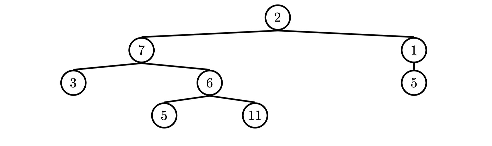

## 1 Representation - A Note on Str and Repr

相似但不同目的

str，人类阅读

repr，机器阅读，debug 和 develop


## Questions

### 1.1

```python
>>> A("one")
nothing ❎
one ❎
<__main__.A at 0x10e87ef30> ✅

>>> print(A("one"))
oneone

>>> repr(A("two"))
two
'two'

>>> b = B()
boo!

>>> b.add_a(A("a"))
nothing

>>> b.add_a(A("b"))
nothing

>>> b
2
aabb
```


## 2 Linked Lists

### Implementation

### Questions

### 2.1 ✅

编写函数，输入 linked list，返回元素和，假设所有元素为整数

```python
def sum_nums(lnk):
    num = 0
    while lnk is not Link.empty:
      num += lnk.first
      lnk = lnk.rest
    return num
```


### 2.2 ❎ ⭐️

输入 linked list 的 list，返回元素对应乘积，返回新 linked list

如果并非所有的 Link 对象长度相等，则返回一个长度与最短链表相同的链表。你可以假设这些 Link 对象是浅层链表，并且 `lst of lnks` 至少包含一个链表。


### 2.3 ✅

教程：编写一个递归函数 `flip_two`，该函数接受一个链表 `lnk` 作为输入，并修改 `lnk`，使得每一对相邻的元素互换位置。


### 2.4 ✅ ❎

实现 `filter_link`，该函数接受一个链表 `link` 和一个函数 `f`，返回一个生成器，该生成器会产生 `link` 中所有使 `f` 返回 `True` 的值。

尝试使用 `while` 循环和不使用任何形式的迭代两种方法来实现此函数。


非迭代？递归


## 3 Trees

请注意，通过 Class 实现，可以使用 attribute assignment 来改变一棵树，这在前面的 lists 实现中是不可能的。

### Questions

### 3.1 ✅

定义一个函数 `make_even`，该函数接收一棵值为整数的树 `t`，并对这棵树进行原地修改（mutate）。使得树中所有奇数值加 1（变成偶数），而所有偶数值保持不变。


### 3.2 ✅

定义一个函数 square_tree(t)，它会将非空树 t 中的每个值都平方。你可以假设树中每个值都是数字。


### 3.3 ❎ ⭐️⭐️ 类似 hw05 Q6

定义一个过程 `find_paths`，它接收一棵树 `t` 和一个值 `entry`，返回一个“路径列表的列表”。每个路径是一个列表，包含从树 `t` 的根节点到值为 `entry` 的节点所经过的所有节点。你可以按任意顺序返回这些路径。

例如，给定如下的树 `tree_ex`，`find_paths` 应该返回：




### 3.4 ❎ ⭐️⭐️ 类似 Lab05 Q10

编写一个函数，将两棵树 `t1` 和 `t2` 中对应节点的值通过 `combiner` 函数进行合并。假设 `t1` 和 `t2` 具有相同的结构。这个函数应该返回一棵新的树。

提示：可以考虑使用 `zip()` 函数。`zip()` 返回一个迭代器，它将传入的可迭代对象中的第一个元素配对组成第一个元组，第二个元素配对组成第二个元组，依此类推。


### 3.5 ✅

实现一个交替树映射函数，该函数接收一个函数和一个树作为输入，从根节点开始，将该函数应用于树的每一层交替层级上的所有数据。


