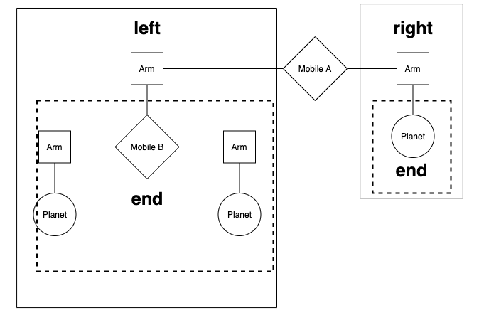
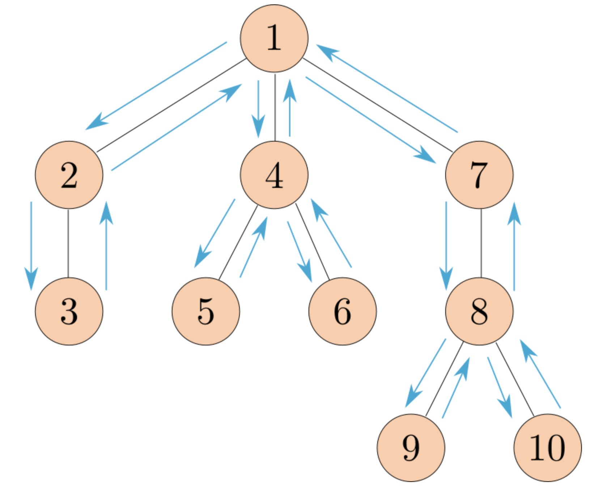

## Abstraction

## Mobiles

我们正在制作一个**行星仪悬挂模型（planetarium mobile）**。

移动装置（mobile）是一种悬挂雕塑。

二叉移动装置（binary mobile）由两条悬臂（arms）组成。

每条悬臂是一根特定长度的杆，其一端挂着**一个行星（planet）**，或者挂着**另一个移动装置（mobile）**。

例如，下图展示了**移动装置 A** 的**左臂和右臂**，以及它们各自末端悬挂的内容。



我们将使用以下**数据抽象（data abstractions）\**来表示\**二叉移动装置（binary mobile）**。

- **一个移动装置（mobile）\**必须包含\**左臂（left arm）\**和\**右臂（right arm）**。
- **一个悬臂（arm）\**具有\**正长度（positive length）**，并且**必须悬挂某物**（either a **移动装置**或**行星**）。
- **一个行星（planet）\**具有\**正质量（positive size）**，并且**没有任何悬挂物**。


### **递归中的“臂长”问题（Arms-length Recursion）（附注）**

在开始之前，先对**树形数据结构（tree data structures）**中的递归进行一个简要说明。考虑以下函数：

```python
def min_depth(t):
    """返回从 t 的根节点到最近叶子节点的距离"""
    if is_leaf(t):
        return 0  # 基本情况——节点到自身的距离为 0
    h = float('inf')  # Python 中的“无穷大”
    for b in branches(t):
        if is_leaf(b): return 1  # !!! 违反“臂长”递归的地方
        h = min(h, 1 + min_depth(b))
    return h
```

标记 **!!!** 的那一行代码违反了**“臂长”递归原则（arms-length recursion）**。虽然这段代码不会影响正确性，但它做了一些本该由**下一层递归**来完成的工作。我们的 `min_depth` 函数已经包含了一个 `if` 语句来处理**叶子节点（leaf）**的情况，因此不需要额外检查 `b` 是否是叶子节点，这样会造成**代码的冗余**。

更简洁且符合递归原则的代码如下：

```python
def min_depth(t):
    """返回从 t 的根节点到最近叶子节点的距离"""
    if is_leaf(t):
        return 0
    h = float('inf')
    for b in branches(t):
        # 仍然可以正常工作！
        h = min(h, 1 + min_depth(b))
    return h
```

### **为什么要避免“臂长”递归？**

“臂长”递归不仅会导致**代码冗余**，还可能让代码更加复杂，使递归函数的功能变得**难以理解**，从而增加编写递归函数的难度。因此，在编写递归函数时，我们应确保**每一层递归只处理它自己应该处理的内容**，不应该过度检查或者预先处理**下一层递归本该执行的任务**。

在编写代码的过程中，我们可能会定期检查是否存在类似的问题。


### Q1: Weights✅

### **实现行星（planet）的数据抽象**

请完成 `planet` 的构造函数（`planet` 构造器）和 `size` 选择器（`size` 访问器），使行星能够用**一个两元素列表**来表示，其中：

- **第一个元素** 是字符串 `'planet'`，用于标识该对象是一个行星。
- **第二个元素** 是行星的大小（size），表示该行星的重量。

此外，下面提供了 `total_weight` 这个示例函数，它展示了如何使用 `mobile`、`arm` 和 `planet` 这些数据抽象。


### Q2: Balanced❌

### **实现 `balanced` 函数**

请实现 `balanced` 函数，该函数用于判断一个 `mobile` 是否平衡。

**一个 `mobile` 需要满足以下两个条件才能被认为是平衡的：**

1. **左右两侧的力矩（torque）相等**
   - 力矩的计算方式：**力矩 = 杆的长度 × 该杆上悬挂物体的总重量**
   - 例如：如果**左侧的杆长为 `5`**，且其悬挂的物体总重量为 `10`，那么左侧的力矩就是 `5 × 10 = 50`。
   - **右侧也必须满足相同的计算方式，且左侧力矩 = 右侧力矩，才能认为当前 `mobile` 平衡。**
2. **悬挂在左右两侧的 `mobile` 也必须是平衡的**
   - 如果某一侧悬挂的是 `planet`，则该侧天然是平衡的（因为 `planet` 本身没有其他悬挂物）。
   - 但如果某一侧悬挂的是 `mobile`，那么这个 `mobile` 也必须是平衡的，才能保证整个 `mobile` 结构的稳定。

**特殊情况：**

- `planet` 本身是平衡的，因为它没有额外的悬挂结构，因此 `planet` 默认返回 `True`。


### Q3: Totals✅

### **实现 `totals_tree` 函数**

请实现 `totals_tree` 函数，该函数接收一个 `mobile` 或 `planet` 作为输入，并返回一个树（tree）。

**函数要求：**

1. **如果输入是 `planet`**
   - 返回一个**叶子节点（leaf）**，其值为 `planet` 的大小（即 `planet` 的重量）。
2. **如果输入是 `mobile`**
   - 返回一个**树（tree）**，其**根节点的值为 `mobile` 的总重量**。
   - **子节点（branches）** 是该 `mobile` 左右两侧 `arm` 末端的 `totals_tree` 递归结果。


## Trees

### Q4: Replace Leaf ❌✅

请实现 `replace_leaf` 函数，该函数接受以下参数：

- **`t`**：一个树（Tree）
- **`find_value`**：需要查找的叶子节点值
- **`replace_value`**：替换后的值

**功能：**
返回一个新的树，该树与 `t` 结构相同，但所有叶子节点中等于 `find_value` 的值都会被替换为 `replace_value`。非叶子节点保持不变。


### Q5: Preorder✅

请实现 `preorder` 函数，该函数接受一个树（Tree）作为参数，并返回一个 **按先序遍历（Preorder Traversal）** 排序的 **所有节点值的列表**。

**先序遍历 (Preorder Traversal) 规则：**

1. **先访问根节点**（Root）。
2. **递归访问每个子树**（从左到右）。

这种顺序与 `print_tree` 打印的顺序相同。



### Q6: Has Path ✅

请实现 `has_path` 函数，该函数接受一棵树 `t` 和一个字符串 `word`，如果存在一条从 **根节点开始的路径**，使得沿途的节点标签**依次**拼出 `word`，则返回 `True`，否则返回 `False`。

这个数据结构被称为 **"字典树 (trie)"**，它在很多应用中非常有用，比如 **自动补全 (autocomplete)**。

### **函数要求**

- **路径必须从根节点开始**，不能从中间的节点开始。
- **路径只能往下走**，不能回溯或跳跃。
- **路径中的节点标签拼接后必须与 `word` 完全匹配**。


# Extra Questions

### Q7: Interval Abstraction ✅❌

Alyssa 的程序尚未完成，因为她还没有实现 **区间（interval）抽象** 的选择器（selectors）。

她已经为你实现了 **构造函数（constructor）**，请你补充 **选择器的实现**。

```python
➜  hw03 py3 ok -q interval -u             
=====================================================================
Assignment: Homework 3
OK, version v1.18.1
=====================================================================

~~~~~~~~~~~~~~~~~~~~~~~~~~~~~~~~~~~~~~~~~~~~~~~~~~~~~~~~~~~~~~~~~~~~~
Unlocking tests

At each "? ", type what you would expect the output to be.
Type exit() to quit

---------------------------------------------------------------------
interval > Suite 1 > Case 1
(cases remaining: 2)

>>> import hw03
>>> from hw03 import *
>>> str_interval(interval(-1, 2))
? -1 to 2
-- Not quite. Try again! --

? '-1' to '2
-- Not quite. Try again! --

? '-1' to '2'
-- Not quite. Try again! --

? '-1 to 2'
-- OK! --

>>> str_interval(add_interval(interval(-1, 2), interval(4, 8)))
? '3 to 10'
-- OK! --
```


Louis Reasoner 提供了一个 **区间乘法（interval multiplication）** 的实现。

但要注意：他的代码 **违反了数据抽象原则（data abstraction violations）**，请你在有人愤怒地把它烧掉之前，帮他修正！🔥

```python
➜  hw03 py3 ok -q mul_interval -u                
=====================================================================
Assignment: Homework 3
OK, version v1.18.1
=====================================================================

~~~~~~~~~~~~~~~~~~~~~~~~~~~~~~~~~~~~~~~~~~~~~~~~~~~~~~~~~~~~~~~~~~~~~
Unlocking tests

At each "? ", type what you would expect the output to be.
Type exit() to quit

---------------------------------------------------------------------
mul_interval > Suite 1 > Case 1
(cases remaining: 2)

>>> import hw03
>>> from hw03 import *
>>> str_interval(mul_interval(interval(-1, 2), interval(4, 8)))
? '-8 to 16'
-- OK! --

---------------------------------------------------------------------
mul_interval > Suite 2 > Case 1
(cases remaining: 1)

-- Already unlocked --

---------------------------------------------------------------------
OK! All cases for mul_interval unlocked.
```


### Q8: Sub Interval✅

使用类似 Alyssa 的推理方法，为区间定义一个减法函数。 如果发现自己在重复代码，请尝试重用已经实现的函数。

```python
➜  hw03 py3 ok -q sub_interval -u                    
=====================================================================
Assignment: Homework 3
OK, version v1.18.1
=====================================================================

~~~~~~~~~~~~~~~~~~~~~~~~~~~~~~~~~~~~~~~~~~~~~~~~~~~~~~~~~~~~~~~~~~~~~
Unlocking tests

At each "? ", type what you would expect the output to be.
Type exit() to quit

---------------------------------------------------------------------
sub_interval > Suite 1 > Case 1
(cases remaining: 2)

>>> import hw03
>>> from hw03 import *
>>> str_interval(sub_interval(interval(-1, 2), interval(4, 8)))
? '-9 to -2'
-- OK! --

---------------------------------------------------------------------
sub_interval > Suite 2 > Case 1
(cases remaining: 1)

-- Already unlocked --
```


### Q9: Div Interval ❎

Alyssa 通过乘以 yyy 的倒数来实现了除法。系统编程专家 Ben Bitdiddle 看了 Alyssa 的代码后评论说，除以一个跨越零的区间含义不清楚。请在 Alyssa 的代码中添加一个 `assert` 语句，以确保不会使用这样的区间作为除数。


```python
➜  hw03 py3 ok -q div_interval -u                    

=====================================================================
Assignment: Homework 3
OK, version v1.18.1
=====================================================================

~~~~~~~~~~~~~~~~~~~~~~~~~~~~~~~~~~~~~~~~~~~~~~~~~~~~~~~~~~~~~~~~~~~~~
Unlocking tests

At each "? ", type what you would expect the output to be.
Type exit() to quit

---------------------------------------------------------------------
div_interval > Suite 1 > Case 1
(cases remaining: 2)

>>> import hw03
>>> from hw03 import *
>>> # Type AssertionError if you think an AssertionError is raised
>>> str_interval(div_interval(interval(-1, 2), interval(4, 8)))
? 
-- Not quite. Try again! --

? '-4 to 2'
-- Not quite. Try again! --

? '-0.25 to 0.5'
-- OK! --

>>> str_interval(div_interval(interval(4, 8), interval(-1, 2)))
? '-8 to 4'
-- Not quite. Try again! --

? '-8 to 4'
-- Not quite. Try again! --

? AssertionError: Divisor interval cannot span zero.
-- Not quite. Try again! --

? 'AssertionError: Divisor interval cannot span zero.'
-- Not quite. Try again! --

? Error
-- Not quite. Try again! --

? AssertionError
-- OK! --

---------------------------------------------------------------------
div_interval > Suite 2 > Case 1
(cases remaining: 1)

-- Already unlocked --

---------------------------------------------------------------------
OK! All cases for div_interval unlocked.

Performing authentication
```


### Q10: Par Diff ？没看懂

经过大量工作，Alyssa P. Hacker 终于完成了她的系统。几年后，在她已经完全忘记这件事的时候，她接到了用户 Lem E. Tweakit 的一个狂怒电话。

Lem 发现，**并联电阻的公式** 可以用两种在代数上等价的方式表示：

```
par1(r1, r2) = (r1 * r2) / (r1 + r2)
```

or

```
par2(r1, r2) = 1 / (1/r1 + 1/r2)
```

Lem 提出，Alyssa 的程序在计算并联电阻公式时，会得到不同的结果，而这确实是一个严重的问题。

为了证明 Lem 是正确的，我们需要在不同的算术表达式上测试系统的行为。具体来说，我们需要构造一些区间 `r1` 和 `r2`，并展示 `par1(r1, r2)` 和 `par2(r1, r2)` 的计算结果可能不同。

**任务：**
在 `check_par` 函数中，返回两个区间，使得 `par1` 和 `par2` 计算出的区间不同。

```
def check_par():
    """Return two intervals that give different results for parallel resistors.

    >>> r1, r2 = check_par()
    >>> x = par1(r1, r2)
    >>> y = par2(r1, r2)
    >>> lower_bound(x) != lower_bound(y) or upper_bound(x) != upper_bound(y)
    True
    """
    r1 = interval(1, 1) # 替换这行代码！
    r2 = interval(1, 1) # 替换这行代码！
    return r1, r2
```

然后，使用 `Ok` 进行测试：


### Q11: Multiple References

Eva Lu Ator 的观点是正确的，原因在于 **Multiple References Problem（多重引用问题）**。当我们在计算中多次引用同一个区间（即具有不确定性的数），误差会在计算过程中被放大，使得计算结果的误差范围变得更大。

在 `par1` 计算方式中，`r1` 和 `r2` 都被多次使用：

```python
par1(r1, r2) = (r1 * r2) / (r1 + r2)
```

由于 `r1` 和 `r2` 都是不确定的区间，它们的误差在加法和乘法过程中会累积，使得最终计算出的区间范围更大。

相比之下，`par2` 计算方式：

```python
par2(r1, r2) = 1 / (1/r1 + 1/r2)
```

这个公式避免了对 `r1` 和 `r2` 的重复引用，因此误差不会被放大，从而得到更精确的区间。


### Q12: Quadratic ✅

编写一个函数 `quadratic`，它返回所有 `f(t)` 的区间，其中 `t` 在参数区间 `x` 内，`f(t)` 是一个二次函数：

```
f(t) = a*t*t + b*t + c
```

确保你的实现返回最小的区间，并且不会受到**多重引用问题（Multiple References Problem）**的影响。

**提示**:
导数 `f'(t) = 2a t + b`，其极值点（可能是最小值或最大值）发生在：

-b/(2*a)


