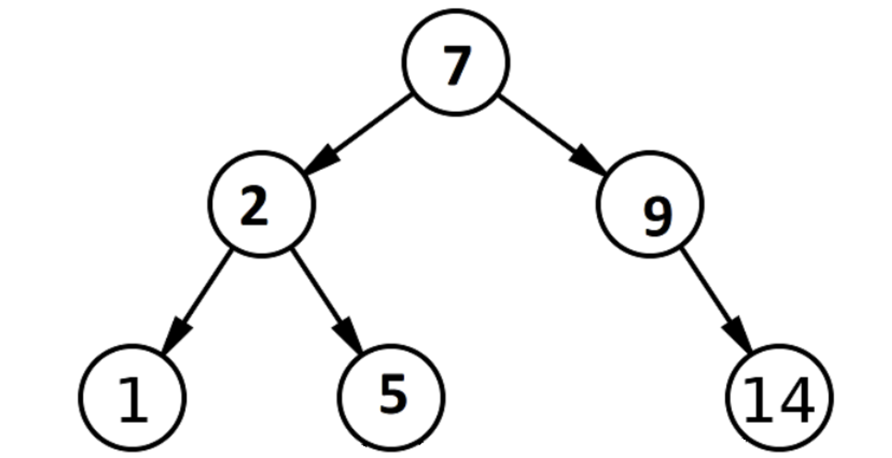
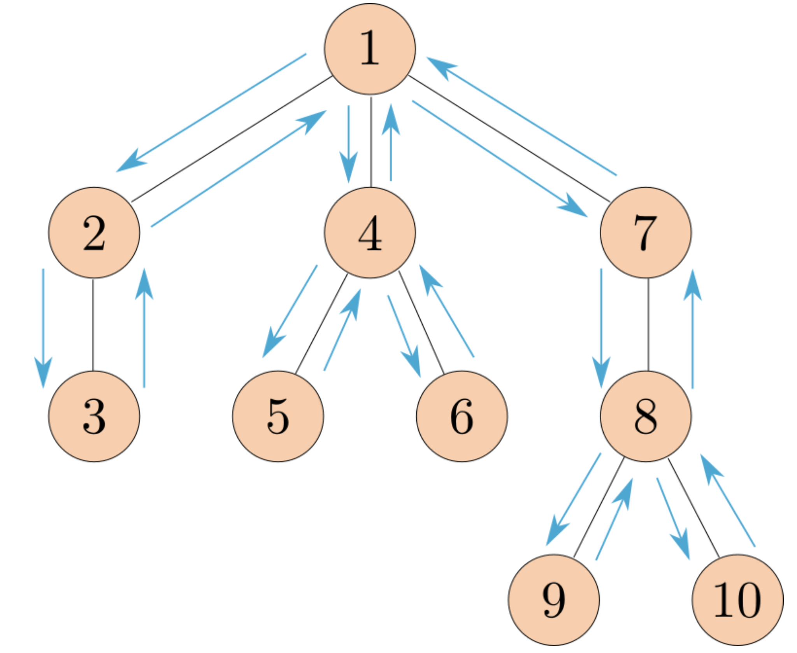

## OOP

### Q1: Vending Machine ✅

创建一个名为 `VendingMachine` 的类，它表示某种产品的自动售货机。`VendingMachine` 对象应返回描述其交互的字符串。

完善 `VendingMachine` 类，添加合适的属性和方法，使其行为符合以下 doctests。


### Q2: Mint ✅

完善 `Mint` 和 `Coin` 类，使铸币厂创建的硬币具有正确的年份和价值。

- 每个 `Mint` 实例都有一个年份标记 (`year`)。`update` 方法将年份标记设置为 `Mint` 类的 `current_year` 类属性。
- `create` 方法接受 `Coin` 的子类，并返回该子类的一个实例，该实例的年份标记为铸币厂的年份（如果 `Mint` 没有更新，则可能与 `Mint.current_year` 不同）。
- `Coin` 的 `worth` 方法返回硬币的面值（`cents`），如果硬币的年龄超过 50 年，则每超过 1 年，额外增加 1 美分。硬币的年龄可以通过 `Mint.current_year - 硬币的年份` 计算得到。


## Linked Lists

### Q3: Store Digits ❎✅ ⭐️

编写一个函数 `store_digits`，该函数接受一个整数 `n`，并返回一个链表，其中链表的每个元素都是 `n` 的一位数字。

**注意**：不要使用任何字符串操作函数，比如 `str` 或 `reversed`。


如何拿到数字的第一个数字和剩下的数字是关键

```python
# 递归方案
    # if n == 0:
    #     return Link.empty
    # elif n < 10:
    #     return Link(n) 
    # else: 
    #     # log10 向下去整, 得到位数
    #     first = n // 10 ** int((math.log10(n)))
    #     last = n - first * 10 ** int((math.log10(n)))
    #     return Link(first, store_digits(last))
```


```python
# 非递归方案, 没想到, 其实更简单的思路
    result = Link.empty
    while n > 0:
        result = Link(n % 10, result)
        n = n // 10
    return result
```


# Extra Questions

## Trees

### Q4: Is BST ❎⭐️⭐️ 分类情况不好想

编写一个函数 `is_bst`，该函数接受一个树 `t`，并且只有当 `t` 是一个有效的二叉搜索树时，才返回 `True`。一个有效的二叉搜索树必须满足以下条件：

1. 每个节点最多有两个子节点（一个叶子节点自动是一个有效的二叉搜索树）。
2. 每个子节点都是有效的二叉搜索树。
3. 对于每个节点，左子树的所有元素都小于或等于该节点的值。
4. 对于每个节点，右子树的所有元素都大于该节点的值。



请注意，如果一个节点只有一个子节点，则该子节点可以视为左子节点或右子节点。你应该考虑到这一点。

提示：编写辅助函数 `bst_min` 和 `bst_max` 来分别返回二叉搜索树的最小值和最大值，可能会对你有所帮助。


### Q5: Preorder ❎ 思路好想，如何记录操作

定义函数 `preorder`，该函数接受一棵树作为参数，并返回一个按 **前序遍历** 顺序排列的所有节点值的列表，顺序应与 `print_tree` 打印的顺序一致。

下图展示了节点的访问顺序，箭头表示函数调用顺序。



## Generators/Trees

### Q6: Yield Paths ❎ ⭐️ 不好想

定义一个生成器函数 `path_yielder`，它接受一棵树 `t` 和一个值 `value`，返回一个生成器对象，该生成器会生成从 `t` 的根节点到标签为 `value` 的节点的所有路径。

`t` 是使用类实现的，而不是基于函数的ADT（抽象数据类型）。

每条路径应该以列表的形式表示，其中包含树中沿路径的所有标签。路径的生成顺序可以是任意的。

我们已经为你提供了一个（部分）代码框架。你不一定要使用这个框架，但如果你的实现与其有较大不同，你可能需要思考如何调整你的代码以适配该框架。

**提示：**如果你不知道如何开始，可以思考如果这不是一个生成器函数，你会如何解决这个问题？你的递归调用会是什么样的？在一个生成器函数中，如果你在函数体内进行“递归调用”，会发生什么？


1. **重复路径**：
   - 如果树中存在多个节点具有相同的标签（例如 `value`），代码会生成所有可能的路径。
2. **路径顺序**：
   - 路径的顺序取决于树的遍历顺序。如果需要特定顺序（例如按路径长度排序），可以在生成路径后对结果进行排序。
3. **生成器特性**：
   - 使用生成器可以高效地生成路径，避免一次性生成所有路径占用大量内存。

