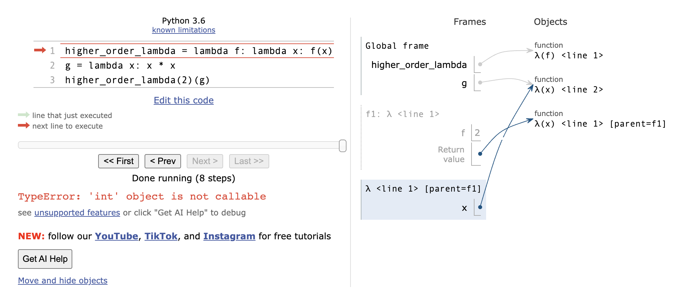

## What Would Python Display?

### Q1: WWPD: Lambda the Free

答案是 <function...>，请键入 Function，如果答案出错，请键入 Error，如果未显示任何内容，则键入 Nothing。

```python
>>> x = None
>>> x
在 Python 解释器中不显示任何内容
```


```python
➜  lab02 py3 ok -q lambda -u
=====================================================================
Assignment: Lab 2
OK, version v1.18.1
=====================================================================

~~~~~~~~~~~~~~~~~~~~~~~~~~~~~~~~~~~~~~~~~~~~~~~~~~~~~~~~~~~~~~~~~~~~~
Unlocking tests

At each "? ", type what you would expect the output to be.
Type exit() to quit

---------------------------------------------------------------------
Lambda the Free > Suite 1 > Case 1
(cases remaining: 7)

Q: Which of the following statements describes a difference between a def statement
and a lambda expression?
Choose the number of the correct choice:
0) A def statement can only have one line in its body.
1) A lambda expression cannot have more than two parameters.
2) A lambda expression does not automatically bind the function object that it returns to any name.
3) A lambda expression cannot return another function.
? 2
-- OK! --

---------------------------------------------------------------------
Lambda the Free > Suite 1 > Case 2
(cases remaining: 6)

Q: How many parameters does the following lambda expression have?
lambda a, b: c + d
Choose the number of the correct choice:
0) Not enough information
1) two
2) three
3) one
? 1
-- OK! --

---------------------------------------------------------------------
Lambda the Free > Suite 1 > Case 3
(cases remaining: 5)

Q: When is the return expression of a lambda expression executed?
Choose the number of the correct choice:
0) When the lambda expression is evaluated.
1) When you pass the lambda expression into another function.
2) When the function returned by the lambda expression is called.
3) When you assign the lambda expression to a name.
? 2
-- OK! --

---------------------------------------------------------------------
Lambda the Free > Suite 2 > Case 1
(cases remaining: 4)

What would Python display? If you get stuck, try it out in the Python
interpreter!

>>> # If Python displays <function...>, type Function, if it errors type Error
>>> lambda x: x  # A lambda expression with one parameter x
? Function
-- OK! --

>>> a = lambda x: x  # Assigning a lambda function to the name a
>>> a(5)
? 5
-- OK! --

>>> (lambda: 3)()  # Using a lambda expression as an operator in a call exp.
? 3
-- OK! --

>>> b = lambda x: lambda: x  # Lambdas can return other lambdas!
>>> c = b(88)
>>> c
? 88
-- Not quite. Try again! --

? x
-- Not quite. Try again! --

? None
-- Not quite. Try again! --

? Nothing
-- Not quite. Try again! --

? Error
-- Not quite. Try again! --

? Function
-- OK! --

>>> c()
? Nothing
-- Not quite. Try again! --

? x
-- Not quite. Try again! --

? 88
-- OK! --

>>> d = lambda f: f(4)  # They can have functions as arguments as well
>>> def square(x):
...     return x * x
>>> d(square)
? 16
-- OK! --

---------------------------------------------------------------------
Lambda the Free > Suite 2 > Case 2
(cases remaining: 3)

What would Python display? If you get stuck, try it out in the Python
interpreter!

>>> x = None # remember to review the rules of WWPD given above!
>>> x
>>> lambda x: x
? Function
-- OK! --

---------------------------------------------------------------------
Lambda the Free > Suite 2 > Case 3
(cases remaining: 2)

What would Python display? If you get stuck, try it out in the Python
interpreter!

>>> #
>>> # Pay attention to the scope of variables
>>> z = 3
>>> e = lambda x: lambda y: lambda: x + y + z
>>> e(0)(1)()
? 4
-- OK! --

>>> f = lambda z: x + z
>>> f(3)
? Error
-- OK! --

---------------------------------------------------------------------
Lambda the Free > Suite 2 > Case 4
(cases remaining: 1)

What would Python display? If you get stuck, try it out in the Python
interpreter!

>>> # Try drawing an environment diagram if you get stuck!
>>> higher_order_lambda = lambda f: lambda x: f(x)
>>> g = lambda x: x * x
>>> higher_order_lambda(2)(g) # Which argument belongs to which function call?
? 4
-- Not quite. Try again! --

? Error
-- OK! --

>>> higher_order_lambda(g)(2)
? 4
-- OK! --

>>> call_thrice = lambda f: lambda x: f(f(f(x)))
>>> call_thrice(lambda y: y + 1)(0)
? 3
-- OK! --

>>> print_lambda = lambda z: print(z)
>>> print_lambda
? Function
-- OK! --

>>> one_thousand = print_lambda(1000)
? 1000
-- OK! --

>>> one_thousand
? 1000
-- Not quite. Try again! --

? None
-- Not quite. Try again! --

? Nothing
-- OK! --

---------------------------------------------------------------------
OK! All cases for Lambda the Free unlocked.
```


### 易错和迷惑处

lambda 表达式参数数量有限制？没有

(lambda: 3)() 没参数 lambda 表达式


打印信息vs调用

```python
>>> b = lambda x: lambda: x  # Lambdas can return other lambdas!
>>> c = b(88)
>>> c

c		 打印命名绑定的信息
c()  调用
```


```python
>>> f = lambda z: x + z
>>> f(3)
? Error

找不到 x 报错
```


```python
>>> # Try drawing an environment diagram if you get stuck!
>>> higher_order_lambda = lambda f: lambda x: f(x)
>>> g = lambda x: x * x
>>> higher_order_lambda(2)(g) # Which argument belongs to which function call?
? 4
-- Not quite. Try again! --

? Error
-- OK! --

>>> higher_order_lambda(g)(2)
? 4
-- OK! --
```




### Q2: WWPD: Higher Order Functions

```python
Higher Order Functions > Suite 1 > Case 2
(cases remaining: 1)

What would Python display? If you get stuck, try it out in the Python
interpreter!

>>> def cake():
...    print('beets')
...    def pie():
...        print('sweets')
...        return 'cake'
...    return pie
>>> chocolate = cake()
? Function
-- Not quite. Try again! --

? beets
-- OK! --

>>> chocolate
? Function
-- OK! --

>>> chocolate()
(line 1)? beets
-- Not quite. Try again! --

(line 1)? sweets
(line 2)? cake
-- Not quite. Try again! --

(line 1)? beets
-- Not quite. Try again! --

(line 1)? sweets
(line 2)? beets
-- Not quite. Try again! --

(line 1)? sweets
(line 2)? beets
-- Not quite. Try again! --

(line 1)? sweets
(line 2)? Nothing
-- Not quite. Try again! --

(line 1)? beets
-- Not quite. Try again! --

(line 1)? sweets
(line 2)? 'cake'
-- OK! --

>>> more_chocolate, more_cake = chocolate(), cake
? Nothing
-- Not quite. Try again! --

? Error
-- Not quite. Try again! --

? sweets
-- OK! --

>>> more_chocolate
? Function
-- Not quite. Try again! --

? 'cake'
-- OK! --

>>> def snake(x, y):
...    if cake == more_cake:
...        return chocolate
...    else:
...        return x + y
>>> snake(10, 20)
? Function
-- OK! --

>>> snake(10, 20)()
(line 1)? sweets
(line 2)? 'cake'
-- OK! --

>>> cake = 'cake'
>>> snake(10, 20)
? 30
-- OK! --

---------------------------------------------------------------------
OK! All cases for Higher Order Functions unlocked.
```


```python
>>> def cake():
...    print('beets')
...    def pie():
...        print('sweets')
...        return 'cake'
...    return pie
>>> chocolate = cake()
? Function
-- Not quite. Try again! --

? beets
-- OK! --

>>> chocolate
? Function
-- OK! --

>>> chocolate()
(line 1)? beets
-- Not quite. Try again! --

(line 1)? sweets
(line 2)? cake
-- Not quite. Try again! --

(line 1)? beets
-- Not quite. Try again! --

(line 1)? sweets
(line 2)? beets
-- Not quite. Try again! --

(line 1)? sweets
(line 2)? beets
-- Not quite. Try again! --

(line 1)? sweets
(line 2)? Nothing
-- Not quite. Try again! --

(line 1)? beets
-- Not quite. Try again! --

(line 1)? sweets
(line 2)? 'cake'
-- OK! --
```


chocolate = cake() 

此时 pie() 和 chocolate 命名绑定

chocolate() 调用时，先打印再返回，返回值也输出，但是带''


```python
>>> more_chocolate, more_cake = chocolate(), cake
? Nothing
-- Not quite. Try again! --

? Error
-- Not quite. Try again! --

? sweets
-- OK! --

>>> more_chocolate
? Function
-- Not quite. Try again! --

? 'cake'
-- OK! --
```


chocolate 此时绑定 pie()

chocolate() 等价于 call pie()，因此打印 sweets

more_chocolate 绑定到 pie() 调用的返回值 'cake' 上


## Coding Practice

### Q3: Lambdas and Currying

用 lambda 柯里化任意两个参数的函数

```python
return lambda func: lambda x: lambda y: func(x, y)
和
return lambda x: lambda y: func(x, y)
```

因为本身用 def 定义了函数 lambda_curry2(func) ，因此再 lambda func: ... 重复了


### Q4: Count van Count

抽象概括相似逻辑

```python
# 此处调用传入的匿名函数
if condition(n, i):
```


## Environment Diagram Practice

没有提交，但鼓励自己纸上画图完成

### Q5: Make Adder

1. In the Global frame, the name `add_ten` points to a function object. What is the intrinsic name of that function object, and what frame is its parent?
   1. lambda 函数没有内置命名
   2. make_adder 帧，即 f1
2. What name is frame `f2` labeled with (`add_ten` or λ)? Which frame is the parent of `f2`?
   1. add_ten错了，应该是 lambda。add_ten 只是绑定的命名，而非函数名
   2. Global错了，应该是 f1
3. What value is the variable `result` bound to in the Global frame?
   1. 19

```python
----Global----
n = 9
make_adder -> func
----f1: make_adder---parent=Global----
n + 1 向上查找 n = 9
形参 n = 10
return -> lambda func

----Global----
n = 9
make_adder -> func
add_ten -> lambda func

----f2:lambda func---parent=f1----
形参 n 向上查找 = 9 ，实际为匿名函数的 k
return = 9 + 10 = 19

----Global----
n = 9
make_adder -> func
add_ten -> lambda func
result = 19
```


### Q6: Lambda the Environment Diagram

```python
----Global----
a -> lambda func
b -> func
x = 3
----f1:b()----parent=Global----
形参 b -> lambda func
形参 x 向上找 = 3
return lambda func
----lambda func----parent=b()----
形参 x = 3 + lambda func(3)
----lambda func----parent=b()----
形参 x=3
return 3 * 2 + 1 = 7

----lambda func----parent=b()----
形参 x = 3 + 7 = 10
return 10 * 2 + 1 = 21

打印 21
```


# Optional Questions

### Q7: Composite Identity Function

组合函数，返回 *f*(*g*(*x*)) == *g*(*f*(*x*))

### Q8: I Heard You Liked Functions...

循环函数，三个函数作为参数， 


模除循环，lambda 表达式 + 递归构成函数嵌套组合

