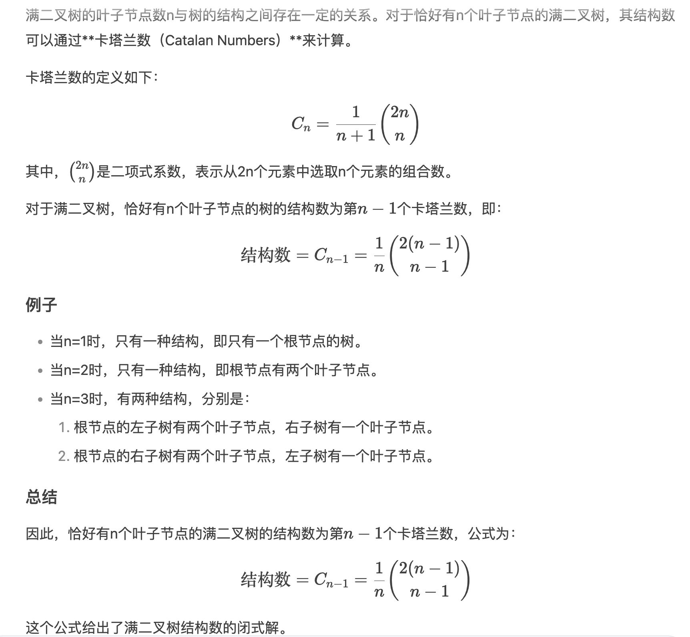
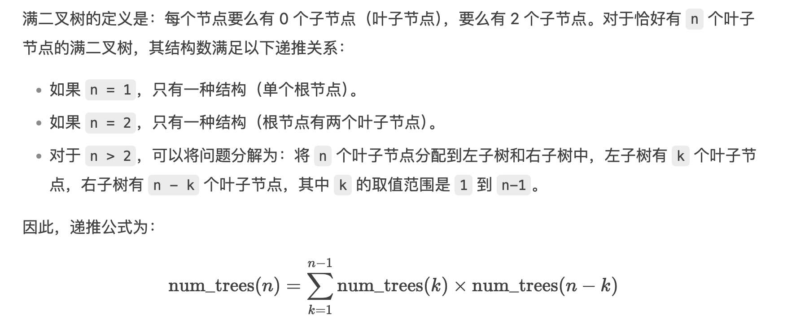

# Required Questions

### Q1: All Questions Are Optional

本作业中的以下问题不计入成绩，但强烈建议你完成它们，以帮助你为即将到来的期中考试做准备。即使你没有完成这些问题，你仍然可以获得该实验的学分。


# Suggested Questions

## Recursion and Tree Recursion

### Q2: Subsequences ❎✅ ⭐️

一个序列 S 的子序列是指，从 S 中按照原有顺序依次选取若干元素（可以跳过元素），形成的新序列。因此，列表 `[]`、`[1, 3]`、`[2]` 和 `[1, 2, 3]` 都是 `[1, 2, 3]` 的一些（但不是全部）子序列。

请编写一个函数，该函数接受一个列表，返回一个由列表组成的列表，其中每个子列表都是原始输入的一个子序列。


为了实现这个功能，你可能首先需要编写一个名为 `insert_into_all` 的函数。这个函数接收一个元素和一个由列表组成的列表，并将该元素添加到每个子列表的开头，最终返回新的列表。


### Q3: Increasing Subsequences ❎❎ ⭐️⭐️

和上一个问题类似，我们要编写一个函数，它接受一个列表，并返回一个由列表组成的列表，其中每个子列表都是原始输入的一个子序列。

但这次我们有一个额外的条件：我们只希望返回那些连续元素是非递减的子序列。例如，`[1, 3, 2]` 是 `[1, 3, 2, 4]` 的一个子序列，但因为 `2 < 3`，所以这个子序列不应该包含在我们返回的结果中。

请填写空白，完成 `inc_subseqs` 函数的实现。

你可以假设输入列表中没有负数。

你可以使用已提供的辅助函数 `insert_into_all`，它接受一个元素和一个由列表组成的列表，并将该元素插入到每个子列表的开头。


难点：用 prev 记录最后被选中的元素


### Q4: Number of Trees ❎

满二叉树是指每个节点要么有2个分支，要么没有分支，但绝不会只有1个分支的树。

有多少种可能的满二叉树结构恰好有n个叶子节点？

对于对组合数学感兴趣的人来说，这个问题确实有一个闭式解）：





这个问题的解实际上是 **卡塔兰数（Catalan Numbers）** 的第 `n-1` 项。


## Generators

### Q5: Generators generator ❎，太难理解，逻辑拗口

编写一个生成器函数 `make_generators_generator`，它接受一个无参数的生成器函数 `g`，并返回一个生成器，该生成器会生成多个生成器。

对于调用 `g` 返回的生成器对象生成的每个元素 `e`，都会生成一个新的生成器对象，该生成器对象会生成由 `g` 返回的生成器生成的从 `1` 到 `e` 的所有元素。


## Objects

### Q6: Keyboard ✅

我们希望创建一个 `Keyboard` 类，该类接受任意数量的 `Button`，并将这些 `Button` 存储在一个字典中。字典的键是表示键盘位置的整数，值是相应的 `Button`。请根据每个方法的描述填充 `Keyboard` 类中的方法，并使用 doctests 作为参考来实现 `Keyboard` 的行为。


## Nonlocal

### Q7: Advanced Counter ✅

完成 `make_advanced_counter_maker` 的定义，该函数用于创建一个生成计数器的函数。这些计数器不仅可以更新它们自己的计数值，还可以更新所有计数器共享的计数值。它们还可以重置任意一个计数值。


## Mutable Lists

### Q8: Trade ✅

在整数市场中，每个参与者都有一个由正整数组成的列表用于交易。

当两个参与者相遇时，他们会交换自己列表中**最小的非空前缀**。前缀是从索引 0 开始的一段切片。


请编写一个函数 `trade`，用于交换 `first` 和 `second` 两个列表中最前面的 `m` 个元素和 `n` 个元素。

**要求**是：这 `m` 个元素与 `n` 个元素的**元素和**要相等，并且这个和要**尽可能小**。

如果不存在这样的前缀（即没有能满足条件的 `m` 和 `n`），函数应返回字符串 `'No deal!'`，并且不能修改任何一个列表。

否则，函数需要交换两个列表的前缀，并返回字符串 `'Deal!'`。


### 提示：

你可以通过**切片赋值**来修改列表的内容。

要实现切片赋值，可以在赋值语句的左边指定一个切片 `lst[i:j]`，右边给一个新的列表。

该操作会用新列表的元素，**替换**原来 `i` 到 `j` 范围内的全部元素。

需要注意的是：切片和新列表的长度可以不同！


#### 例子：

```python
>>> a = [1, 2, 3, 4, 5, 6]
>>> b = a
>>> a[2:5] = [10, 11, 12, 13]  # 把索引 2 到 5（不包含 5）之间的元素换掉
>>> a
[1, 2, 10, 11, 12, 13, 6]
>>> b
[1, 2, 10, 11, 12, 13, 6]
```

这里 `a` 和 `b` 是同一个列表，所以都改了。


另外回顾一下切片索引的写法：

- `lst[i:]` 和 `lst[i:len(lst)]` 是等价的，表示从索引 `i` 到最后
- `lst[:j]` 和 `lst[0:j]` 是等价的，表示从开头到索引 `j`（不包含 `j`）


### Q9: Shuffle ✅

定义一个函数 `shuffle`，该函数接收一个包含偶数个元素（卡片）的序列，并创建一个新的列表，其中将前一半元素与后一半元素交叉排列（交错混合）。


## Linked Lists

### Q10: Insert ❎ 固定模式影响思路，迭代 or 递归？都要考虑

实现一个函数 `insert`，该函数接收一个 `Link`（链表）、一个值和一个索引，然后将该值插入到链表中指定的索引位置。

你可以假设传入的链表至少有一个元素。这个函数不需要返回任何值——`insert` 应该直接修改（mutate）传入的链表。

注意：如果索引超出范围，可以通过以下方式抛出 `IndexError` 异常：

```shell
raise IndexError
```


### Q11: Deep Linked List Length ✅

一个包含一个或多个链表作为元素的链表被称为深度链表（deep linked list）。

编写一个函数 `deep_len`，该函数接收一个（可能是深度的）链表，并返回该链表的深度长度（deep length）。

一个链表的深度长度是指该链表中所有非链表元素的总数，以及所有嵌套链表中元素的总数。可以参考函数的 doctest 示例来理解深度链表的长度如何计算。

提示：可以使用 `isinstance` 来检查某个对象是否是某个类型的实例。


### Q12: Linked Lists as Strings ✅

Kevin 和 Jerry 喜欢用不同的方式在 Python 中展示链表（linked list）的结构。Kevin 喜欢用方框和指针图（box and pointer diagrams），而 Jerry 更喜欢一种更“未来感”的展示方式。

请编写一个函数 `make_to_string`，它返回一个函数。这个返回的函数能够根据他们各自喜欢的风格，把链表转换成对应的字符串。

### 提示

你可以使用 `str` 函数将数字转换为字符串，也可以使用 `+` 来拼接字符串。


## Trees

### Q13: Prune Small ✅

请完成函数 `prune_small`，该函数接受一棵树 `t` 和一个数字 `n`，并对 `t` 进行**原地修改**（mutatively）。

具体要求如下：

- 如果 `t` 或者它的任意子树（branches）拥有超过 `n` 个分支（branches），
- 那么你需要保留标签（label）最小的 `n` 个分支，
- 并且将其它的分支**修剪**（prune），也就是从树中删除。

换句话说，如果某个节点的分支数超过了 `n`，你就要删掉分支标签比较大的，留下最小的 `n` 个。

最终返回值不做要求，但树 `t` 自身应该已经被修改。


