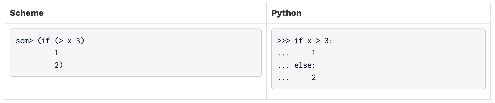
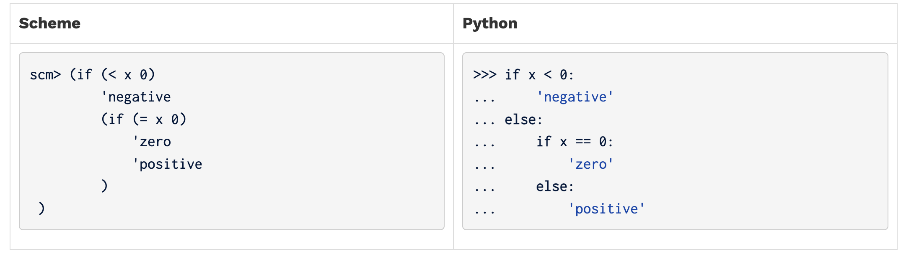
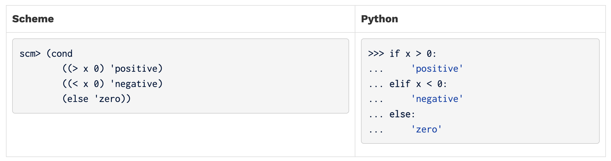
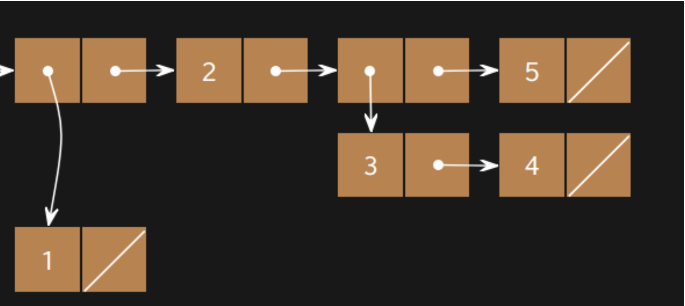

## Scheme

Scheme 是 1970 年代诞生的一种著名的**函数式编程语言**。它是 **Lisp（LISt Processing，列表处理语言）的一种方言**。

大多数人第一眼注意到的是它独特的语法：**采用前缀表示法**，并且（经常）有**大量嵌套的括号**（参见 [xkcd 的漫画](http://xkcd.com/297/)）。

Scheme 支持**一等函数（first-class functions）**和**优化的尾递归（tail recursion optimization）**，在当时都是比较新的特性。


我们的课程使用的是一个定制版 Scheme（你将在 Project 4 中亲自实现它）。这个版本的 Scheme 包含在起始的 ZIP 文件中。要启动解释器，可以输入以下命令：

```
python3 scheme
```

如果你想交互式地运行一个 Scheme 程序，可以输入：

```
python3 scheme -i <file.scm>
```

要退出 Scheme 解释器，输入：

```
(exit)
```

你可能会发现 [code.cs61a.org/scheme](https://code.cs61a.org/scheme) 很有用，特别是在完成练习题的时候。它可以绘制环境模型（environment diagrams）和 box-and-pointer 图，并且允许你逐步调试代码（类似于 Python Tutor）。不过别忘了最后通过 Ok 提交你的代码哦！


## Scheme 编辑器

在编写代码时，你可以通过 Scheme 编辑器进行调试。在 `scheme` 文件夹里，你会发现一个新的编辑器。运行它的方法是：

```
python3 editor
```

这样应该会在你的浏览器中弹出一个窗口。如果没有，请手动访问这个地址：

```
localhost:31415
```

你就可以看到编辑器界面了。

⚠️ 小提示：记得在另一个终端标签页或窗口中运行以下命令，以确保编辑器持续运行：

```
python3 ok
```

如果你发现在在线编辑器（code.cs61a.org/scheme）上运行正常，但在你自己的解释器上有问题，很可能是你之前某部分代码存在 bug。你需要仔细排查一下。有时候，测试用例无法覆盖所有情况，如果你发现了测试没发现的 bug，记得告诉我们！


## Scheme 语法

## Expressions 表达式

### Atomic Expressions 原子表达式，数字、布尔、符号

```scheme
scm> 1234
scm> 123.4
```

#### Symbols 符号

**symbol（符号）** 在 Python 中没有。一个 **symbol** 在 Scheme 中的作用很像 Python 里的名字（name），但又不完全相同。具体来说，Scheme 中的 **symbol** 也是一种值（value）的类型。而在 Python 中，名字只作为表达式的一部分存在；一个 Python 表达式永远不会直接求值为“名字”本身。

```scheme
scm> quotient      ; A name bound to a built-in procedure
#[quotient]
scm> 'quotient     ; An expression that evaluates to a symbol
quotient
scm> 'hello-world!
hello-world!
```

#### Booleans

在 Scheme 中，除了特殊的布尔值 `#f` 以外，所有的值都会被解释为真值（与 Python 不同，Python 中有一些假值，比如 `0`、空字符串等）。在我们使用的这个特定版本的 Scheme 解释器中，你可以使用 `True` 和 `False` 来代替标准的 `#t` 和 `#f`。不过，这并不是标准写法。

### Call Expressions 调用表达式

运算符写在所有操作数的前面

运算符也包含在括号内，并且操作数之间用空格分隔，而不是用逗号。

Scheme 调用表达式的求值规则和 Python 完全相同：

1. 求值运算符（即操作符）。它应该求值为一个过程（函数）。
2. 从左到右依次求值操作数。
3. 将求值后的操作数传递给过程（函数），进行调用。

```scheme
scm> (+ 1 2)
3
scm> (- 10 (/ 6 2))
7
scm> (modulo 35 4)
3
scm> (even? (quotient 45 2))
#t
```

### Speicial forms

特殊形式表达式的运算符就是一种特殊形式（special form）。之所以称为“特殊”，是因为它们不遵循上一节提到的三个求值规则。而是每种特殊形式都有自己特定的求值规则，比如在求值所有操作数之前会进行短路（short-circuiting）判断等。

我们今天将学习的一些特殊形式包括：`if`、`cond`、`define` 和 `lambda`。阅读下方对应的小节，可以了解它们各自的求值规则！

## Control Structures

### If Expressions

`if` 是一种特殊形式（special form），允许根据一个谓词（predicate）来决定求值两个表达式中的哪一个。

它有两个必需参数和一个可选的第三个参数：

```
(if <predicate> <if-true> [if-false])
```

第一个操作数是谓词表达式（predicate expression），在 Scheme 中，这个表达式的值会被解释为 `#t`（真）或者 `#f`（假）。

`if` 表达式的求值规则如下：

1. 计算 `<predicate>` 表达式的值。
2. 如果 `<predicate>` 的值为真（truth-y），则求值并返回 `<if-true>` 表达式的结果。否则（为假），求值并返回 `[if-false]`（如果有提供的话）的结果。

你能看出为什么 `if` 表达式是一种特殊形式吗？可以对比一下普通函数调用表达式和 `if` 表达式之间的差异。

在普通函数调用表达式（call expression）的求值规则中，第二步要求对所有操作数从左到右全部求值。而在 `if` 表达式中，只会对两个操作数求值，一个是条件表达式 `<predicate>`，另一个是 `<if-true>` 或 `<if-false>` 中的其中一个。因为没有对所有的操作数求值，所以它是特殊形式。



尽管代码看起来很相似，但实际求值方式是完全不同的。

- Scheme 中的 `if` 是一个表达式（expression），会求值并返回一个值。
- Python 中的 `if` 是一个语句（statement），它只是控制程序的执行流程，而不是返回值。

还有一个区别是，Python 的 `if` 语句的代码块可以写多行代码，但 Scheme 的 `if` 表达式只接受一个表达式作为 `<if-true>` 和 `<if-false>` 的结果。

此外，Scheme 的 `if` 表达式不支持 `elif` 分支。如果你想实现多个分支判断，只能通过嵌套 `if` 表达式来实现：



### Cond Expressions

使用嵌套的 `if` 表达式来处理多种情况似乎并不是很实用。

相反，可以使用 `cond` 特殊形式（special form），它是一个通用的条件表达式，类似于 Python 中的多条件 `if/elif/else` 结构。

`cond` 接受任意数量的参数，这些参数称为子句（clauses）。每个子句写作一个包含两个表达式的列表：

```scheme
(cond
    (<p1> <e1>)
    (<p2> <e2>)
    ...
    (<pn> <en>)
    [(else <else-expression>)])
```

每个子句中的第一个表达式是谓词（predicate），即条件判断。

第二个表达式是当谓词为真时所返回的表达式（return expression）。

最后可以有一个可选的 `else` 子句，它没有谓词，通常表示“所有条件都不满足时”的默认情况。

#### `cond` 的求值规则如下：

1. 从上到下依次计算谓词 `<p1>`、`<p2>`、...、`<pn>`。
2. 一旦某个谓词的值为真（truth-y），就会执行对应子句的表达式 `<e>`，并返回该结果。
3. 如果所有的谓词都不为真，而存在 `else` 子句，那么会求值并返回 `<else-expression>`。
4. 一旦命中某个为真的谓词，其后的子句将不会继续求值（短路行为，short-circuiting）。

可以看到，`cond` 是一种特殊形式（special form），因为它不会像普通函数调用那样一次性评估所有操作数，而是根据不同的子句分别求值谓词和结果表达式。此外，一旦找到第一个满足条件的谓词，剩下的子句将不会继续求值。




## Lists

在阅读本节内容时，你可能会觉得很难理解 Scheme 不同容器表示之间的差异。我们建议你使用课程提供的在线 Scheme 解释器，来查看 pairs（对）和 lists（列表）的 box-and-pointer（盒子与箭头）图示，以帮助你更好地理解它们的结构！你可以通过输入 `(autodraw)` 命令来切换自动绘制图示的功能

### 列表（Lists）

Scheme 中的列表（list）和我们在 Python 中学习过的链表（linked list）非常相似。

 就像 Python 的链表是由一系列 `Link` 对象组成的，Scheme 的列表则是由一系列的 `pair`（对）构成的，而 `pair` 是通过构造函数 `cons` 来创建的。

在 Scheme 中，合法的列表要求 `cdr` 部分要么是另一个列表（另一个 `pair`），要么是 `nil`（表示空列表）。

Scheme 解释器中，列表会被显示为一串值（类似于 Python `Link` 对象的 `__str__` 表现）。例如：

```
scm> (cons 1 (cons 2 (cons 3 nil)))
(1 2 3)
```

在这个例子中，我们确保了每一个 `cons` 表达式的第二个参数都是另一个 `cons` 表达式或 `nil`，从而构成一个合法的 Scheme 列表结构。


我们可以使用 `car` 和 `cdr` 过程从列表中取值，这两个过程的功能类似于 Python `Link` 对象中的 `first` 和 `rest` 属性。（好奇这两个奇怪名字的由来吗？可以去查查它们的词源哦！）

```
scm> (define a (cons 1 (cons 2 (cons 3 nil))))  ; 把这个列表赋值给名字 a
a
scm> a
(1 2 3)
scm> (car a)
1
scm> (cdr a)
(2 3)
scm> (car (cdr (cdr a)))
3
```

如果你在 `cons` 的第二个参数中传入的不是 `pair`（对）或 `nil`，它会报错：

```
scm> (cons 1 2)
Error
```

------

### `list` 过程

除了用 `cons` 构造列表以外，还有其他创建列表的方法。
 `list` 过程可以接收任意数量的参数，并用这些参数的值来构建一个列表：

```
scm> (list 1 2 3)
(1 2 3)
scm> (list 1 (list 2 3) 4)
(1 (2 3) 4)
scm> (list (cons 1 (cons 2 nil)) 3 4)
((1 2) 3 4)
```

注意，在这个 `list` 表达式里，所有的操作数在加入到最终的列表之前都会先被求值。

------

### `quote` 表达式（引号形式）

你也可以使用 `quote` 形式来创建一个列表，这种方式会直接构建出你写出来的列表。
 和 `list` 过程不同的是，`quote` 的参数不会被求值。

```
scm> '(1 2 3)
(1 2 3)
scm> '(cons 1 2)           ; 参数不会被求值
(cons 1 2)
scm> '(1 (2 3 4))
(1 (2 3 4))
```

------

### 列表的内建过程（Built-In Procedures for Lists）

Scheme 还提供了一些用于处理列表的内建过程。你可以在解释器里试试看！

```
scm> (null? nil)                ; 检查某个值是否为空列表
True
scm> (append '(1 2 3) '(4 5 6)) ; 拼接两个列表
(1 2 3 4 5 6)
scm> (length '(1 2 3 4 5))      ; 返回列表中元素的数量
5
```

------


## Defining procedures

特殊形式 `define` 用于在 Scheme 中定义变量和函数。

 `define` 有两种用法，分别用于**定义变量**和**定义过程（函数）**。

### 1. 定义变量

使用 `define` 来给变量赋值的语法如下：

```
(define <名字> <表达式>)
```

**求值规则如下**：

1. 先对 `<表达式>` 进行求值。
2. 把这个值绑定（bind）到当前环境（frame）中的 `<名字>` 上。
3. 返回 `<名字>`。

------

### 2. 定义过程（函数）

`define` 也可以直接用来定义过程（类似 Python 里的函数定义）。
 语法如下：

```
(define (<名字> <参数1> <参数2> ...) <函数体> )
```

**求值规则如下**：

1. 用给定的参数和 `<函数体>` 创建一个 `lambda` 过程（相当于匿名函数）。
2. 把这个过程绑定到当前环境中的 `<名字>` 上。
3. 返回 `<名字>`。

------

### 示例

下面这两种写法是完全等价的：

```
scm> (define foo (lambda (x y) (+ x y)))
foo
scm> (define (foo x y) (+ x y))
foo
```

------

### 为什么 `define` 是特殊形式？

`define` 被称为“特殊形式”，是因为它的操作数（operands）根本**不会被求值**！

- 比如，在定义函数的时候，`<函数体>` 并不会立刻执行，而是等到函数被调用时才执行。
- `<名字>` 和参数名也只是符号，它们不会在 `define` 执行时被求值。


## Lambdas

所有的 Scheme 过程（procedures）其实都是 lambda 过程（lambda procedures）。

 要创建一个 lambda 过程，可以使用 `lambda` 这个特殊形式（special form），语法如下：

```
(lambda (<参数1> <参数2> ...) <函数体>)
```

这个表达式会创建并返回一个带有指定参数和函数体的函数，但**不会改变当前的环境**。

这一点和 Python 中的匿名函数（lambda 表达式）非常相似！

```scheme
scm> (lambda (x y) (+ x y))        ; Returns a lambda function, but doesn't assign it to a name
(lambda (x y) (+ x y))
scm> ((lambda (x y) (+ x y)) 3 4)  ; Create and call a lambda function in one line
7
```

一个过程可以接受任意数量的参数。

`<函数体>`（body）里可以写多条表达式，**但返回值是最后一个表达式的结果**。

在 Scheme 中**没有**像 Python 那样的 `return` 语句。


# Required Questions

## What Would Scheme Display?

### Q1: Combinations

```scheme
➜  lab10 py3 ok -q combinations -u
=====================================================================
Assignment: Lab 10
OK, version v1.18.1
=====================================================================

~~~~~~~~~~~~~~~~~~~~~~~~~~~~~~~~~~~~~~~~~~~~~~~~~~~~~~~~~~~~~~~~~~~~~
Unlocking tests

At each "? ", type what you would expect the output to be.
Type exit() to quit

---------------------------------------------------------------------
What Would Scheme Display? > Suite 1 > Case 1
(cases remaining: 4)


scm> (- 10 4)
? 6
-- OK! --

scm> (* 7 6)
? 42
-- OK! --

scm> (+ 1 2 3 4)
? 10
-- OK! --

scm> (/ 8 2 2)
? 2
-- OK! --

scm> (quotient 29 5)
? 5
-- OK! --

scm> (modulo 29 5)
? 4
-- OK! --

---------------------------------------------------------------------
What Would Scheme Display? > Suite 1 > Case 2
(cases remaining: 3)


scm> (= 1 3)                    ; Scheme uses '=' instead of '==' for comparison
? #f
-- OK! --

scm> (< 1 3)
? #t
-- OK! --

scm> (or #t #f)                 ; or special form short circuits
? #t
-- OK! --

scm> (and #t #f (/ 1 0))
? #f
-- OK! --

scm> (not #t)
? #f
-- OK! --

---------------------------------------------------------------------
What Would Scheme Display? > Suite 1 > Case 3
(cases remaining: 2)

# 返回 define 的
scm> (define x 3)
? x
-- OK! --

scm> x
? 3
-- OK! --

scm> (define y (+ x 4))
? y
-- OK! --

scm> y
? 7
-- OK! --

scm> (define x (lambda (y) (* y 2)))
? x
-- OK! --

scm> (x y)
? 14
-- OK! --

---------------------------------------------------------------------
What Would Scheme Display? > Suite 1 > Case 4
(cases remaining: 1)


scm> (if (print 1) (print 2) (print 3))
(line 1)? 1
(line 2)? 2
-- OK! --

scm> (* (if (> 3 2) 1 2) (+ 4 5))
? 10
-- Not quite. Try again! --

? 9
-- OK! --

scm> (define foo (lambda (x y z) (if x y z)))
? foo
-- OK! --


# 先计算参数，在执行 foo
scm> (foo 1 2 (print 'hi))
(line 1)? 2
-- Not quite. Try again! --

(line 1)? hi
(line 2)? 2
-- OK! --

# 引用，不计算值
scm> ((lambda (a) (print 'a)) 100)
? a
-- OK! --

---------------------------------------------------------------------
OK! All cases for What Would Scheme Display? unlocked.

Performing authentication
Please enter your school email (.edu): ^C%  
```


## Coding Questions

### Q2: Over or Under ✅

定义一个名为 `over-or-under` 的过程，它接收两个数字 `num1` 和 `num2`。

根据这两个数字的大小关系，返回以下结果：

- 如果 `num1` 小于 `num2`，返回 `-1`
- 如果 `num1` 等于 `num2`，返回 `0`
- 如果 `num1` 大于 `num2`，返回 `1`

```scheme
➜  lab10 py3 ok -q over_or_under -u                       
=====================================================================
Assignment: Lab 10
OK, version v1.18.1
=====================================================================

~~~~~~~~~~~~~~~~~~~~~~~~~~~~~~~~~~~~~~~~~~~~~~~~~~~~~~~~~~~~~~~~~~~~~
Unlocking tests

At each "? ", type what you would expect the output to be.
Type exit() to quit

---------------------------------------------------------------------
over-or-under > Suite 1 > Case 1
(cases remaining: 3)

scm> (load-all ".")
scm> (over-or-under 5 5)
? 0
-- OK! --

---------------------------------------------------------------------
over-or-under > Suite 1 > Case 2
(cases remaining: 2)

scm> (load-all ".")
scm> (over-or-under 5 4)
? 1
-- OK! --

---------------------------------------------------------------------
over-or-under > Suite 1 > Case 3
(cases remaining: 1)

scm> (load-all ".")
scm> (over-or-under 3 5)
? -1
-- OK! --

---------------------------------------------------------------------
OK! All cases for over-or-under unlocked.

Performing authentication
Please enter your school email (.edu): ^C% 
```


### Q3: Make Adder ✅

编写一个名为 `make-adder` 的过程（procedure）。

它接受一个初始数字 `num`，然后返回另一个过程。

这个返回的过程接收一个数字 `inc`，并返回 `num + inc` 的结果。

**提示：**

要返回一个过程，你可以使用 `lambda` 表达式，或者定义一个嵌套过程（nested procedure）。

记住，在 Scheme 中，一个过程会自动返回它主体中的最后一个表达式的值。


```scheme
➜  lab10 py3 ok -q make_adder -u                     
=====================================================================
Assignment: Lab 10
OK, version v1.18.1
=====================================================================

~~~~~~~~~~~~~~~~~~~~~~~~~~~~~~~~~~~~~~~~~~~~~~~~~~~~~~~~~~~~~~~~~~~~~
Unlocking tests

At each "? ", type what you would expect the output to be.
Type exit() to quit

---------------------------------------------------------------------
make-adder > Suite 1 > Case 1
(cases remaining: 4)

scm> (load-all ".")
scm> (define add-two (make-adder 2))
scm> (define add-three (make-adder 3))
scm> (add-two 2)
? 4
-- OK! --

---------------------------------------------------------------------
make-adder > Suite 1 > Case 2
(cases remaining: 3)

scm> (load-all ".")
scm> (define add-two (make-adder 2))
scm> (define add-three (make-adder 3))
scm> (add-two 3)
? 6
-- Not quite. Try again! --

? 5
-- OK! --

---------------------------------------------------------------------
make-adder > Suite 1 > Case 3
(cases remaining: 2)

scm> (load-all ".")
scm> (define add-two (make-adder 2))
scm> (define add-three (make-adder 3))
scm> (add-three 3)
? 6
-- OK! --

---------------------------------------------------------------------
make-adder > Suite 1 > Case 4
(cases remaining: 1)

scm> (load-all ".")
scm> (define add-two (make-adder 2))
scm> (define add-three (make-adder 3))
scm> (add-three 9)
? 12
-- OK! --

---------------------------------------------------------------------
OK! All cases for make-adder unlocked.

Performing authentication
Please enter your school email (.edu): ^C% 
```


### Q4: Compose ✅

编写一个名为 `composed` 的过程（procedure）。

它接受两个过程 `f` 和 `g` 作为参数，并返回一个新的过程。

这个新的过程接受一个数字 `x`，并返回 `f` 作用于 `g(x)` 的结果，也就是 `f(g(x))`。

```scheme
➜  lab10 py3 ok -q composed -u
=====================================================================
Assignment: Lab 10
OK, version v1.18.1
=====================================================================

~~~~~~~~~~~~~~~~~~~~~~~~~~~~~~~~~~~~~~~~~~~~~~~~~~~~~~~~~~~~~~~~~~~~~
Unlocking tests

At each "? ", type what you would expect the output to be.
Type exit() to quit

---------------------------------------------------------------------
composed > Suite 1 > Case 1
(cases remaining: 7)

scm> (load-all ".")
scm> (define (add-one a) (+ a 1))
scm> (define (multiply-by-two a) (* a 2))
scm> ((composed add-one add-one) 2)
? 4
-- OK! --

---------------------------------------------------------------------
composed > Suite 1 > Case 2
(cases remaining: 6)

scm> (load-all ".")
scm> (define (add-one a) (+ a 1))
scm> (define (multiply-by-two a) (* a 2))
scm> ((composed multiply-by-two multiply-by-two) 2)
? 8
-- OK! --

---------------------------------------------------------------------
composed > Suite 1 > Case 3
(cases remaining: 5)

scm> (load-all ".")
scm> (define (add-one a) (+ a 1))
scm> (define (multiply-by-two a) (* a 2))
scm> ((composed add-one multiply-by-two) 2)
? 5
-- OK! --

---------------------------------------------------------------------
composed > Suite 1 > Case 4
(cases remaining: 4)

scm> (load-all ".")
scm> (define (add-one a) (+ a 1))
scm> (define (multiply-by-two a) (* a 2))
scm> ((composed multiply-by-two add-one) 2)
? 6
-- OK! --

---------------------------------------------------------------------
composed > Suite 1 > Case 5
(cases remaining: 3)

scm> (load-all ".")
scm> (define (add-one a) (+ a 1))
scm> (define (multiply-by-two a) (* a 2))
scm> ((composed (composed add-one add-one) add-one) 2)
? 5
-- OK! --

---------------------------------------------------------------------
composed > Suite 1 > Case 6
(cases remaining: 2)

scm> (load-all ".")
scm> (define (add-one a) (+ a 1))
scm> (define (multiply-by-two a) (* a 2))
scm> ((composed (composed add-one add-one) multiply-by-two) 2)
? 6
-- OK! --

---------------------------------------------------------------------
composed > Suite 1 > Case 7
(cases remaining: 1)

scm> (load-all ".")
scm> (define (add-one a) (+ a 1))
scm> (define (multiply-by-two a) (* a 2))
scm> ((composed multiply-by-two (composed add-one add-one)) 2)
? 8
-- OK! --

---------------------------------------------------------------------
OK! All cases for composed unlocked.

Performing authentication
Please enter your school email (.edu): ^C%
```


# Optional Questions

### Q5: Make a List ✅

创建具有以下 box-and-pointer（框图和指针）结构的列表：




```scheme
➜  lab10 py3 ok -q make_structure -u             
=====================================================================
Assignment: Lab 10
OK, version v1.18.1
=====================================================================

~~~~~~~~~~~~~~~~~~~~~~~~~~~~~~~~~~~~~~~~~~~~~~~~~~~~~~~~~~~~~~~~~~~~~
Unlocking tests

At each "? ", type what you would expect the output to be.
Type exit() to quit

---------------------------------------------------------------------
make-list > Suite 1 > Case 1
(cases remaining: 2)

scm> (load-all ".")
scm> (define a '(1))
? a
-- OK! --

scm> a
? (1)
-- OK! --

scm> (define b (cons 2 a))
? b
-- OK! --

scm> b
? (cons 2 a)
-- Not quite. Try again! --

? cons
-- Not quite. Try again! --

? 2
-- Not quite. Try again! --

? 2 a 
-- Not quite. Try again! --

? (2 1)
-- OK! --

scm> (define c (list 3 b))
? c
-- OK! --

scm> c
? (3 2 1)
-- Not quite. Try again! --

? (list 3 2 1)
-- Not quite. Try again! --

? (3 2 1 nil)
-- Not quite. Try again! --

? (3 (2 1))
-- OK! --

scm> (car c)
? 3
-- OK! --

scm> (cdr c)
? (2 1)
-- Not quite. Try again! --

? ((2 1))
-- OK! --

scm> (car (car (cdr c)))
? 2
-- OK! --

scm> (cdr (car (cdr c)))
? 1
-- Not quite. Try again! --

? (1)
-- OK! --

---------------------------------------------------------------------
make-list > Suite 1 > Case 2
(cases remaining: 1)

scm> (load-all ".")
scm> lst  ; type out exactly how Scheme would print the list
? nil
-- Not quite. Try again! --

? error
-- Not quite. Try again! --

? (3 2 1)
-- Not quite. Try again! --

? ((1) 2 (3 4) 5)
-- OK! --

---------------------------------------------------------------------
OK! All cases for make-list unlocked.

Performing authentication
Please enter your school email (.edu): ^C% 
```

cdr 带（）


### Q6: Remove ❎

实现一个名为 `remove` 的过程，它接受一个列表 `lst` 和一个元素 `item`，返回一个新的列表，新的列表是 `lst` 中删除了所有等于 `item` 的元素之后的结果。

 你可以假设 `lst` 只包含数字，不会有嵌套列表。

提示：你可能会发现 `filter-lst` 过程很有用。

```scheme
➜  lab10 py3 ok -q remove -u                      
=====================================================================
Assignment: Lab 10
OK, version v1.18.1
=====================================================================

~~~~~~~~~~~~~~~~~~~~~~~~~~~~~~~~~~~~~~~~~~~~~~~~~~~~~~~~~~~~~~~~~~~~~
Unlocking tests

At each "? ", type what you would expect the output to be.
Type exit() to quit

---------------------------------------------------------------------
remove > Suite 1 > Case 1
(cases remaining: 5)

scm> (load-all ".")
scm> (remove 3 nil)
? ()
-- OK! --

---------------------------------------------------------------------
remove > Suite 1 > Case 2
(cases remaining: 4)

scm> (load-all ".")
scm> (remove 2 '(1 3 2))
? (1 3)
-- OK! --

---------------------------------------------------------------------
remove > Suite 1 > Case 3
(cases remaining: 3)

scm> (load-all ".")
scm> (remove 1 '(1 3 2))
? (3 2)
-- OK! --

---------------------------------------------------------------------
remove > Suite 1 > Case 4
(cases remaining: 2)

scm> (load-all ".")
scm> (remove 42 '(1 3 2))
? (1 3 2)
-- OK! --

---------------------------------------------------------------------
remove > Suite 1 > Case 5
(cases remaining: 1)

scm> (load-all ".")
scm> (remove 3 '(1 3 3 7))
? (1 7)
-- OK! --

---------------------------------------------------------------------
OK! All cases for remove unlocked.

Performing authentication
Please enter your school email (.edu): ^C%
```


## ✅ 基础构造和访问

| 函数    | 功能说明                                        | 示例                          |
| ------- | ----------------------------------------------- | ----------------------------- |
| `cons`  | 创建一个新的 pair（用作链表的节点）             | `(cons 1 '(2 3))` → `(1 2 3)` |
| `list`  | 创建一个列表                                    | `(list 1 2 3)` → `(1 2 3)`    |
| `car`   | 返回 pair 的第一个元素（相当于 Python 的 head） | `(car '(1 2 3))` → `1`        |
| `cdr`   | 返回 pair 的第二个元素（相当于 Python 的 tail） | `(cdr '(1 2 3))` → `(2 3)`    |
| `null?` | 判断是否为空列表                                | `(null? '())` → `#t`          |

## ✅ 常用列表操作

### `length`

- 功能：返回列表的长度

- 示例：

  ```
  scheme
  
  
  复制编辑
  (length '(1 2 3 4)) ; → 4
  ```

### `append`

- 功能：连接多个列表，返回一个新列表

- 示例：

  ```
  scheme
  
  
  复制编辑
  (append '(1 2 3) '(4 5 6)) ; → (1 2 3 4 5 6)
  ```

### `reverse`

- 功能：反转一个列表

- 示例：

  ```
  scheme
  
  
  复制编辑
  (reverse '(1 2 3)) ; → (3 2 1)
  ```

------

## ✅ 查找和过滤（不同实现可能有所不同）

### `member`

- 功能：检查一个元素是否在列表中，返回从该元素开始的子列表（若不存在返回 `#f`）

- 示例：

  ```
  scheme
  
  
  复制编辑
  (member 2 '(1 2 3)) ; → (2 3)
  (member 4 '(1 2 3)) ; → #f
  ```

### `memq` / `memv`

- 更快但更严格（常用于符号或基本类型）

------

## ✅ 高阶函数（有些 Scheme 实现内置）

### `map`

- 功能：将函数应用到列表的每个元素，返回新列表

- 示例：

  ```
  scheme
  
  
  复制编辑
  (map (lambda (x) (* x x)) '(1 2 3)) ; → (1 4 9)
  ```

### `filter`（标准 Scheme 可能没内置，CS61A 自己实现了 `filter-lst`）

- 功能：筛选出使得谓词返回 `#t` 的元素

- 示例（如果有）：

  ```
  scheme
  
  
  复制编辑
  (filter (lambda (x) (> x 2)) '(1 2 3 4)) ; → (3 4)
  ```

------

## ✅ 其它有用函数

### `assoc`

- 功能：查找一个 key 在 `alist`（关联列表）中对应的 pair

- 示例：

  ```
  scheme
  
  
  复制编辑
  (define alist '((a . 1) (b . 2) (c . 3)))
  (assoc 'b alist) ; → (b . 2)
  ```

