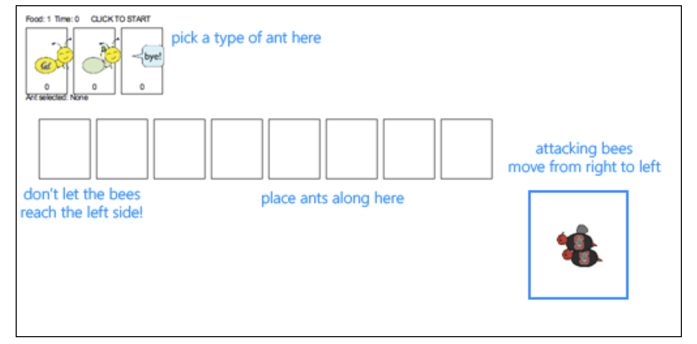
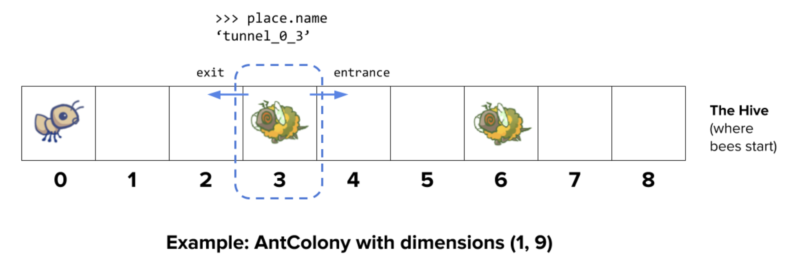

# Project 3: Ants Vs. SomeBees

在这个项目中，你将创建一个名为 **Ants Vs. SomeBees** 的塔防游戏。作为蚂蚁女王，你需要召集最勇敢的蚂蚁保护你的王国免受邪恶

蜜蜂的入侵。当蜜蜂进入你的领地时，你的蚂蚁必须通过投掷树叶来惹恼这些蜜蜂，将它们击退。如果你没有足够有效地驱赶这些空

中侵略者，你的女王将会被蜜蜂的愤怒吞噬。这个游戏灵感来自于PopCap Games的《植物大战僵尸》。

这个项目结合了函数式和面向对象编程范式，重点学习了《Composing Programs》第二章第2.5节的内容。这个项目还涉及理解、扩

展和测试一个庞大的程序。


`ants.zip` 包含了多个文件，但你需要修改的文件是 **ants.py**。

- **ants.py**: 《蚂蚁与蜜蜂》游戏的逻辑部分。
- **ants_gui.py**: 《蚂蚁与蜜蜂》的原始GUI界面。
- **gui.py**: 《蚂蚁与蜜蜂》的新GUI界面。请注意，这个界面目前不太好用，存在一些bug，但你可以在这里看到可爱的小蚂蚁在移动 :)
- **graphics.py**: 用于显示简单二维动画的工具。
- **utils.py**: 一些辅助函数，用于简化游戏界面的实现。
- **ucb.py**: CS 61A的一些工具函数。
- **state.py**: 用于 **gui.py** 的游戏状态抽象。
- **assets**: 一个目录，里面存放着 **gui.py** 使用的图片和文件。
- **img**: 一个目录，存放着 **ants_gui.py** 使用的图片。
- **ok**: 自动评分工具。
- **proj3.ok**: ok配置文件。
- **tests**: 一个目录，包含了用于ok评分的测试文件。


## 项目物流

这是一个项目，你可以和另一个伙伴一起合作。你不应该与非合作伙伴分享你的代码，也不应该抄袭其他人的解决方案。最终，你们将共同提交一个项目。我们强烈建议你们一起完成项目的所有部分，而不是分开工作。可以轮流编写代码，但没有编程的人应通过查看代码、提供方向性评论并捕捉bug来做出贡献。

该项目总分为 **25分**，其中 **22分** 用于正确性，**1分** 用于在检查点日期之前提交第1和第2阶段，**2分** 用于整体结构。

你需要提交以下文件：

- **ants.py**

你不需要修改或提交项目中的其他文件。要提交项目，请运行以下命令：

```
python3 ok --submit
```

你可以在 Ok 仪表板上查看提交记录。

对于要求你完成的函数，我们可能会提供一些初始代码。如果你不想使用这些代码，可以删除它并从头开始。你也可以根据需要添加新的函数定义。

但是，请不要修改其他函数。这样做可能会导致你代码在自动评分测试中失败。另外，请不要更改任何函数签名（包括函数名称、参数顺序或参数个数）。

在整个项目中，你应该测试代码的正确性。我们建议你频繁测试，这样有助于你快速发现问题。然而，你也不应该过度测试，要留出时间思考问题。

我们提供了一个叫做 **ok** 的自动评分工具，帮助你测试代码并跟踪进度。第一次运行自动评分工具时，你需要用浏览器登录你的 Ok 账户。请完成此步骤。每次运行 **ok** 时，它都会将你的工作和进度备份到我们的服务器上。

**ok** 的主要目的是用来测试你的实现。

我们建议你在完成每个问题后提交。只有最后一次提交会被评分。对我们来说，更多的备份有助于解决你提交时遇到的任何问题。如果你忘记提交，你的最后一个备份会被自动转换成提交。

如果你不希望我们记录你的工作或进度信息，可以运行：

```
python3 ok --local
```

使用此选项时，不会将任何信息发送到我们的课程服务器。如果你想交互式地测试代码，可以运行：

```
python3 ok -q [问题编号] -i
```

请将适当的问题编号（例如，01）插入。此命令会运行该问题的测试，直到第一个失败，然后你可以交互式地测试你写的函数。

你还可以使用 **ok** 的调试打印功能，通过写：

```
print("DEBUG:", x)
```

这将在终端中输出信息，而不会导致 **ok** 测试因额外输出而失败。


## The Game

《蚂蚁大战蜜蜂》游戏由一系列回合组成。在每个回合中，首先会有新的蜜蜂进入蚂蚁的巢穴。然后，新的蚂蚁会被放置在巢穴中以防御它们。最后，所有的昆虫（蚂蚁和蜜蜂）会各自采取行动。蜜蜂要么试图向隧道的尽头移动，要么蜇伤它们前方的蚂蚁。蚂蚁则根据类型执行不同的动作，比如收集更多的食物，或者向蜜蜂扔叶子。游戏结束的条件是：蜜蜂到达隧道尽头（你输），或者蜜蜂全军覆没（你赢）。



### Core concepts

**蚂蚁巢穴**
这是游戏发生的地方。蚂蚁巢穴由多个地方连接组成一个隧道，蜜蜂可以通过这个隧道移动。巢穴有一定数量的食物，玩家可以消耗这些食物来部署蚂蚁部队。

**地方**
每个地方与另一个地方相连，形成一个隧道。玩家可以在每个地方放置一只蚂蚁。然而，一个地方可以容纳多个蜜蜂。

**蜂巢**
这是蜜蜂的来源地。蜜蜂从蜂巢出来，进入蚂蚁巢穴。

**蚂蚁**
蚂蚁是玩家可以在游戏中使用的部队，玩家可以将它们部署到巢穴中。每种蚂蚁都有不同的动作，并且需要不同数量的食物来部署。最基础的两种蚂蚁是：收获蚂蚁（HarvesterAnt），它每回合为巢穴增加一单位食物；投掷蚂蚁（ThrowerAnt），它每回合向蜜蜂扔出一片叶子。你将实现更多类型的蚂蚁。

**蜜蜂**
蜜蜂是游戏中的敌方部队，玩家必须防御它们的入侵。每回合，蜜蜂要么向隧道的下一个地方前进（如果前方没有蚂蚁阻挡），要么蜇伤阻挡它们的蚂蚁。蜜蜂胜利的条件是至少有一只蜜蜂到达隧道的尽头。


### Core classes

上述概念每个都有一个对应的类来封装该概念的逻辑。以下是游戏中涉及的主要类的摘要：

**GameState**
表示蚂蚁巢穴和一些关于游戏的状态信息，包括当前可用的食物数量、已经经过的时间、女王蚂蚁所在的位置，以及游戏中的所有地方。

**Place**
表示一个单独的地方，用来容纳昆虫。每个地方最多只能放置一只蚂蚁，但可以容纳多只蜜蜂。Place 对象有一个通往左侧的出口和一个通往右侧的入口，这些地方也是 Place 对象。蜜蜂通过移动到 Place 的出口来穿越隧道。

**Hive**
表示蜜蜂的起始地点（隧道的右侧）。

**AntHomeBase**
表示蚂蚁防守的地方（隧道的左侧）。如果蜜蜂到达这里，游戏结束，蜜蜂获胜 :(

**Insect**
蚂蚁和蜜蜂的父类。所有昆虫都有一个护甲值（armor），表示它们的剩余生命值，以及一个 place 属性，表示它们当前所在的地方。每回合，所有活跃的昆虫都会执行它们的动作。

**Ant**
表示蚂蚁。每个蚂蚁子类都有特殊的属性或动作，使其与其他类型的蚂蚁区别开。例如，收获蚂蚁会为蚂蚁巢穴提供食物，而投掷蚂蚁会攻击蜜蜂。每种蚂蚁类型还会有一个 food_cost 属性，表示部署该类型蚂蚁所需的食物数量。

**Bee**
表示蜜蜂。每回合，蜜蜂要么如果没有蚂蚁阻挡，就向它当前所在地方的出口移动，要么蜇伤阻挡它的蚂蚁。


### Game Layout

下面是一个 **GameState** 的可视化示意图。在完成解锁测试和问题时，我们建议你绘制类似的图表以帮助理解。



### Playing the game

游戏可以在两种模式下运行：基于文本的游戏或使用图形用户界面（GUI）。无论哪种方式，游戏逻辑是相同的，但 GUI 强制施加回合时间限制，使得游戏更加刺激。基于文本的接口则是为了调试和开发提供的。

文件根据这两种模式进行了分离，**ants.py** 不涉及图形或回合时间限制。

要启动基于文本的游戏，请运行：

```
python3 ants_text.py
```

要启动图形版游戏，请运行：

```
python3 ants_gui.py
```

启动图形版时，应该会弹出一个新的浏览器窗口。在初始实现中，你有无限的食物，而且你的蚂蚁只能在当前的 **Place** 中向蜜蜂投掷树叶。在你完成第二个问题之前，GUI 可能会崩溃，因为它还没有完整理解 **Place** 的概念！

游戏有多个选项，你可以在整个项目中使用，可以通过以下命令查看：

```
python3 ants_text.py --help
```

**用法：**

```shell
usage: ants_text.py [-h] [-d DIFFICULTY] [-w] [--food FOOD]

Play Ants vs. SomeBees

optional arguments:
  -h, --help     show this help message and exit
  -d DIFFICULTY  sets difficulty of game (test/easy/medium/hard/extra-hard)
  -w, --water    loads a full layout with water
  --food FOOD    number of food to start with when testing
```


## Phase 1: Basic gameplay


### Problem 0 (0 pt)

在你和你的合作伙伴阅读完 `ants.py` 文件后，回答以下问题。

要提交你的答案，运行以下命令：

```
python3 ok -q 00 -u
```

如果你无法回答这些问题，可以再次阅读文件，查阅上述核心概念/类部分，或者在 Piazza 的问题 0 讨论线程中提问。

1. **一个昆虫的 armor 属性有什么意义？这个值会改变吗？如果会，如何改变？**
   - 装甲，可看做血量。当血量没有了，则在 palce 移除昆虫，表示昆虫死亡
2. **Insect 类的所有属性是什么？**
   - damage，属于类属性✅
3. **Ant 类的 armor 属性是实例属性还是类属性？为什么？**
   - 实例属性
   - 实例化 `__init__` 后才有，每个蚂蚁实例都有该属性，并不共享该属性
4. **Ant 子类（如 ThrowerAnt）的 damage 属性是实例属性还是类属性？为什么？**
   - 类属性，所有子类实例共享该属性 ✅
5. **Ant 和 Bee 都继承自哪个类？**
   - Insect
6. **Ant 和 Bee 的实例有什么共同之处？**
   - 都有damage、血量和地点
   - 都有每回合执行操作，如攻击、移动
7. **在第 9 问题之前，单个 \**Place\** 中可以有多少个昆虫？**
   - ❎？没看见代码哪里体现？bees 是 list，ant 是一个字符。所以可多只蜜蜂
   - 一个 place，一只蚂蚁，多只蜜蜂
8. **蜜蜂在每个回合中做什么？**
   - 只要没有被阻挡，就向前移动位置
   - ❎没想到，若有蚂蚁阻挡，则攻击并减少蚂蚁生命值
9. **游戏何时结束？**
   -  蚂蚁赢，所有蜜蜂被杀
   - 蜜蜂赢，任何 bee 到达通道尽头或蚁后死亡


```python
➜  ants py3 ok -q 00 -u                            
=====================================================================
Assignment: Project 3: Ants Vs. SomeBees
OK, version v1.18.1
=====================================================================

~~~~~~~~~~~~~~~~~~~~~~~~~~~~~~~~~~~~~~~~~~~~~~~~~~~~~~~~~~~~~~~~~~~~~
Unlocking tests

At each "? ", type what you would expect the output to be.
Type exit() to quit

---------------------------------------------------------------------
Problem 0 > Suite 1 > Case 1
(cases remaining: 9)

Q: What is the significance of an Insect's armor attribute? Does this
value change? If so, how?
Choose the number of the correct choice:
0) It represents the strength of an insect against attacks, which
   doesn't change throughout the game
1) It represents the amount of health the insect has left, so the
   insect is eliminated when it reaches 0
2) It represents armor protecting the insect, so the insect can only
   be damaged when its armor reaches 0
? 2
-- Not quite. Try again! --

Choose the number of the correct choice:
0) It represents the strength of an insect against attacks, which
   doesn't change throughout the game
1) It represents the amount of health the insect has left, so the
   insect is eliminated when it reaches 0
2) It represents armor protecting the insect, so the insect can only
   be damaged when its armor reaches 0
? 1
-- OK! --

---------------------------------------------------------------------
Problem 0 > Suite 1 > Case 2
(cases remaining: 8)

Q: Which of the following is a class attribute of the Insect class?
Choose the number of the correct choice:
0) place
1) bees
2) armor
3) damage
? 2
-- Not quite. Try again! --

Choose the number of the correct choice:
0) place
1) bees
2) armor
3) damage
? 0
-- Not quite. Try again! --

Choose the number of the correct choice:
0) place
1) bees
2) armor
3) damage
? 2) 0)
-- Not quite. Try again! --

Choose the number of the correct choice:
0) place
1) bees
2) armor
3) damage
? 2 0 
-- Not quite. Try again! --

Choose the number of the correct choice:
0) place
1) bees
2) armor
3) damage
? 2
-- Not quite. Try again! --

Choose the number of the correct choice:
0) place
1) bees
2) armor
3) damage
? 3
-- OK! --

---------------------------------------------------------------------
Problem 0 > Suite 1 > Case 3
(cases remaining: 7)

Q: Is the armor attribute of the Ant class an instance attribute or class attribute? Why?
Choose the number of the correct choice:
0) class, Ants of the same subclass all have the same amount of starting armor
1) instance, each Ant starts out with a different amount of armor
2) class, when one Ant gets damaged, all ants receive the same amount of damage
3) instance, each Ant instance needs its own armor value
? 1
-- Not quite. Try again! --

Choose the number of the correct choice:
0) class, Ants of the same subclass all have the same amount of starting armor
1) instance, each Ant starts out with a different amount of armor
2) class, when one Ant gets damaged, all ants receive the same amount of damage
3) instance, each Ant instance needs its own armor value
? 3
-- OK! --

---------------------------------------------------------------------
Problem 0 > Suite 1 > Case 4
(cases remaining: 6)

Q: Is the damage attribute of an Ant subclass (such as ThrowerAnt) an
instance or class attribute? Why?
Choose the number of the correct choice:
0) instance, the damage an Ant depends on where the Ant is
1) class, all Ants deal the same damage
2) instance, each Ant does damage to bees at different rates
3) class, all Ants of the same subclass deal the same damage
? 3
-- OK! --

---------------------------------------------------------------------
Problem 0 > Suite 1 > Case 5
(cases remaining: 5)

Q: Which class do both Ant and Bee inherit from?
Choose the number of the correct choice:
0) Bee
1) Ant
2) Insect
3) Place
? 2
-- OK! --

---------------------------------------------------------------------
Problem 0 > Suite 1 > Case 6
(cases remaining: 4)

Q: What do instances of Ant and instances of Bee have in common?
Choose the number of the correct choice:
0) Ants and Bees both have the attributes armor, damage, and place
   and the methods reduce_armor and action
1) Ants and Bees both take the same action each turn
2) Ants and Bees have nothing in common
3) Ants and Bees both have the attribute damage and the methods
   reduce_armor and action
? 0
-- OK! --

---------------------------------------------------------------------
Problem 0 > Suite 1 > Case 7
(cases remaining: 3)

Q: How many insects can be in a single Place at any given time in the
game?
Choose the number of the correct choice:
0) Only one insect can be in a single Place at a time
1) There is no limit on the number of insects of any type in a single Place
2) There can be one Ant and many Bees in a single Place
3) There can be one Bee and many Ants in a single Place
? 2
-- OK! --

---------------------------------------------------------------------
Problem 0 > Suite 1 > Case 8
(cases remaining: 2)

Q: What does a Bee do during one of its turns?
Choose the number of the correct choice:
0) The bee stings the ant in its place and then moves to the next place
1) The bee flies to the nearest Ant and attacks it
2) The bee moves to the next place, then stings the ant in that place
3) The bee stings the ant in its place or moves to the next place if there is no ant in its place
? 0
-- Not quite. Try again! --

Choose the number of the correct choice:
0) The bee stings the ant in its place and then moves to the next place
1) The bee flies to the nearest Ant and attacks it
2) The bee moves to the next place, then stings the ant in that place
3) The bee stings the ant in its place or moves to the next place if there is no ant in its place
? 3
-- OK! --

---------------------------------------------------------------------
Problem 0 > Suite 1 > Case 9
(cases remaining: 1)

Q: When is the game lost?
Choose the number of the correct choice:
0) When any bee reaches the end of the tunnel and the Queen Ant is killed
1) When any bee reaches the end of the tunnel or when the Queen Ant is killed
2) When the bees enter the colony
3) When no ants are left on the map
4) When the colony runs out of food
? 2
-- Not quite. Try again! --

Choose the number of the correct choice:
0) When any bee reaches the end of the tunnel and the Queen Ant is killed
1) When any bee reaches the end of the tunnel or when the Queen Ant is killed
2) When the bees enter the colony
3) When no ants are left on the map
4) When the colony runs out of food
? 0
-- Not quite. Try again! --

Choose the number of the correct choice:
0) When any bee reaches the end of the tunnel and the Queen Ant is killed
1) When any bee reaches the end of the tunnel or when the Queen Ant is killed
2) When the bees enter the colony
3) When no ants are left on the map
4) When the colony runs out of food
? 1
-- OK! --

---------------------------------------------------------------------
OK! All cases for Problem 0 unlocked.

Performing authentication
Please enter your school email (.edu): ^C%  
```


### Problem 1 (1 pt)

首先，需要为不同类型的蚂蚁添加食物成本。当前，没有任何蚂蚁类型的部署需要消耗食物，这使得游戏缺乏挑战性。你会注意到，`Ant` 类的基础食物成本是零。你需要在各个子类中重写这个值，设置正确的成本。

一旦蚂蚁的部署需要消耗食物，我们就需要能够收集更多食物！为了解决这个问题，接下来实现 `HarvesterAnt` 类。`HarvesterAnt` 是一种能够每回合增加一单位食物到 `gamestate.food` 总量的蚂蚁。


现在尝试运行 `python3 ants_gui.py`。

在游戏中，你应该能够部署 `HarvesterAnt`，并且每回合它会为你带来食物。

虽然你也可以放置 `ThrowerAnt`，但请注意，`ThrowerAnt` 只能攻击它所在地点的蜜蜂，这会让游戏变得有些困难。


```python
➜  ants py3 ok -q 01 -u             
=====================================================================
Assignment: Project 3: Ants Vs. SomeBees
OK, version v1.18.1
=====================================================================

~~~~~~~~~~~~~~~~~~~~~~~~~~~~~~~~~~~~~~~~~~~~~~~~~~~~~~~~~~~~~~~~~~~~~
Unlocking tests

At each "? ", type what you would expect the output to be.
Type exit() to quit

---------------------------------------------------------------------
Problem 1 > Suite 1 > Case 1
(cases remaining: 5)

Q: What is the purpose of the food_cost attribute?
Choose the number of the correct choice:
0) Each turn, each Ant in the colony eats food_cost food from the
   colony's total available food
1) Each turn, each Ant in the colony adds food_cost food to the
   colony's total available food
2) Placing an ant into the colony will decrease the colony's total
   available food by that ant's food_cost
? 2
-- OK! --

---------------------------------------------------------------------
Problem 1 > Suite 1 > Case 2
(cases remaining: 4)

Q: What type of attribute is food_cost?
Choose the number of the correct choice:
0) instance, the food_cost of an Ant depends on the location it is placed
1) instance, the food_cost of an Ant is randomized upon initialization
2) class, all Ants cost the same to deploy no matter what type of Ant it is
3) class, all Ants of the same subclass cost the same to deploy
? 3
-- OK! --

---------------------------------------------------------------------
Problem 1 > Suite 2 > Case 1
(cases remaining: 3)

>>> from ants import *
>>> from ants_plans import *
>>> Ant.food_cost
? 0
-- OK! --

>>> HarvesterAnt.food_cost
? 0
-- Not quite. Try again! --

? None
-- Not quite. Try again! --

? -1
-- Not quite. Try again! --

? 1
-- Not quite. Try again! --

? 2
-- OK! --

>>> ThrowerAnt.food_cost
? 3
-- OK! --

---------------------------------------------------------------------
Problem 1 > Suite 2 > Case 2
(cases remaining: 2)

>>> from ants import *
>>> from ants_plans import *
>>> # Testing HarvesterAnt action
>>> # Note that initializing an Ant here doesn't cost food, only
>>> # deploying an Ant in the game simulation does
>>> #
>>> # Create a test layout where the colony is a single row with 9 tiles
>>> beehive = Hive(make_test_assault_plan())
>>> gamestate = GameState(None, beehive, ant_types(), dry_layout, (1, 9))
>>> #
>>> gamestate.food = 4
>>> harvester = HarvesterAnt()
>>> harvester.action(gamestate)
>>> gamestate.food
? 2
-- Not quite. Try again! --

? 0
-- Not quite. Try again! --

? 5
-- OK! --

>>> harvester.action(gamestate)
>>> gamestate.food
? 6
-- OK! --

---------------------------------------------------------------------
Problem 1 > Suite 3 > Case 1
(cases remaining: 1)


>>> from ants import *
>>> HarvesterAnt.implemented
? True
-- OK! --

---------------------------------------------------------------------
OK! All cases for Problem 1 unlocked.

Performing authentication
Please enter your school email (.edu): OK is up to date
```


### Problem 2 (3 pt)

在开始编写代码之前，请阅读以下说明并测试你对问题的理解：

```
python3 ok -q 02 -u
```

### 任务：

完成 `Place` 类的构造函数，通过添加代码来跟踪入口（entrances）。目前，`Place` 类只跟踪出口（exit）。我们希望每个 `Place` 除了跟踪出口之外，还能跟踪入口。

为什么需要入口？在游戏中，蚂蚁需要看到它面前隧道中的蜜蜂，这时入口就变得非常重要。

### 问题的关键：

- 问题的关键是，当你创建一个 `Place` 时，入口应该是 `None`（空），但如果该 `Place` 有出口，那么出口的入口应该指向这个 `Place`。
- 但这里有一个问题：当你创建一个 `Place` 时，如何在构造函数中同时处理入口和出口呢？因为你需要出口和入口才能创建一个 `Place` 对象，所以存在“先有鸡还是先有蛋”的问题。为了解决这个问题，我们将使用以下方法：

### 实现方式：

1. Place 构造函数
   - 一个新创建的 `Place` 对象的入口应初始化为 `None`。
   - 如果该 `Place` 有出口（`exit`），那么该出口的入口应该指向当前 `Place`。

### 提示：

- 在构造函数中，第一个参数 `self` 是绑定到新创建的对象。
- 可以画出两个 `Place` 放在一起，帮助理解如何跟踪出口和入口。图形界面中，一个 `Place` 的入口位于其右侧，出口则位于其左侧。

### 编写代码后，测试你的实现：

```
python3 ok -q 02
```

通过以上步骤，你将实现 `Place` 类的入口跟踪功能，并确保代码能够正常工作。


```python
➜  ants py3 ok -q 02 -u
=====================================================================
Assignment: Project 3: Ants Vs. SomeBees
OK, version v1.18.1
=====================================================================

~~~~~~~~~~~~~~~~~~~~~~~~~~~~~~~~~~~~~~~~~~~~~~~~~~~~~~~~~~~~~~~~~~~~~
Unlocking tests

At each "? ", type what you would expect the output to be.
Type exit() to quit

---------------------------------------------------------------------
Problem 2 > Suite 1 > Case 1
(cases remaining: 5)

Q: What does a Place represent in the game?
Choose the number of the correct choice:
0) Where the bees start out in the game
1) The entire space where the game takes place
2) A single tile that an Ant can be placed on and that connects to
   other Places
3) The tunnel that bees travel through
? 2
-- OK! --

---------------------------------------------------------------------
Problem 2 > Suite 1 > Case 2
(cases remaining: 4)

Q: p is a Place whose entrance is q and exit is r (q and r are not None). When is p.entrance first set to a non-None value?
Choose the number of the correct choice:
0) Never, it is always set to None
1) When q is constructed
2) When p is constructed
? 1
-- OK! --

---------------------------------------------------------------------
Problem 2 > Suite 1 > Case 3
(cases remaining: 3)

Q: p is a Place whose entrance is q and exit is r (q and r are not None). When is p.exit first set to a non-None value?
Choose the number of the correct choice:
0) When q is constructed
1) Never, it is always set to None
2) When p is constructed
? 2
-- OK! --

---------------------------------------------------------------------
Problem 2 > Suite 2 > Case 1
(cases remaining: 2)

>>> from ants import *
>>> from ants_plans import *
>>> #
>>> # Create a test layout where the gamestate is a single row with 3 tiles
>>> beehive, layout = Hive(make_test_assault_plan()), dry_layout
>>> dimensions = (1, 3)
>>> gamestate = GameState(None, beehive, ant_types(), layout, dimensions)
>>> #
>>> # Simple test for Place
>>> place0 = Place('place_0')
>>> print(place0.exit)
? 
-- Not quite. Try again! --

? None
-- OK! --

>>> print(place0.entrance)
? None
-- OK! --

>>> place1 = Place('place_1', place0)
>>> place1.exit is place0
? True
-- OK! --

>>> place0.entrance is place1
? True
-- OK! --

---------------------------------------------------------------------
Problem 2 > Suite 2 > Case 2
(cases remaining: 1)

-- Already unlocked --

---------------------------------------------------------------------
OK! All cases for Problem 2 unlocked.

Performing authentication
Please enter your school email (.edu): OK is up to date
```


### Problem 3 (3 pt)

在开始编写代码之前，请阅读以下说明并测试你对问题的理解：

```
python3 ok -q 03 -u
```

### 任务：

为了使 `ThrowerAnt`（投掷蚂蚁）能够进行攻击，它需要知道应该攻击哪个蜜蜂。目前提供的 `nearest_bee` 方法只能让它攻击同一地点的蜜蜂。你的任务是修复该方法，使得 `ThrowerAnt` 能够攻击它面前最近的蜜蜂（且该蜜蜂不再是蜜蜂巢穴中的蜜蜂）。

`nearest_bee` 方法会从当前地点开始，检查相邻地点的蜜蜂，并返回一个随机的蜜蜂。如果有蜜蜂，`ThrowerAnt` 将攻击它；如果没有蜜蜂，就继续检查下一个地点，直到遇到蜜蜂或遍历完所有地方。

### 实现步骤：

1. 从当前 `Place` 开始：
   - 从 `ThrowerAnt` 当前所在的 `Place` 开始查找。
   - 对于每个地方，如果该地方有蜜蜂，则返回其中的一个蜜蜂；否则，继续检查下一个 `Place`（通过当前 `Place` 的 `entrance` 属性）。
2. 返回一个随机的蜜蜂：
   - 如果某个地方有蜜蜂，则返回一个随机的蜜蜂（`rANTdom_else_none` 函数可以帮你完成这一步）。
   - 如果没有找到蜜蜂，则返回 `None`。

### 提示：

- `rANTdom_else_none` 函数返回一个序列中的随机元素，如果序列为空则返回 `None`。
- 你可以通过在纸上画出游戏的布局来帮助你理解测试用例。

### 编写代码后，测试你的实现：

```
python3 ok -q 03
```

在实现了 `nearest_bee` 方法后，`ThrowerAnt` 应该能够准确地攻击它面前最近的蜜蜂（并且确保蜜蜂不在蜜蜂巢穴中）。你可以使用以下命令进行测试，初始化一个具有 10 食物的游戏以便于测试：

```
python3 ants_gui.py --food 10
```


```python
  ants py3 ok -q 03 -u          
=====================================================================
Assignment: Project 3: Ants Vs. SomeBees
OK, version v1.18.1
=====================================================================

~~~~~~~~~~~~~~~~~~~~~~~~~~~~~~~~~~~~~~~~~~~~~~~~~~~~~~~~~~~~~~~~~~~~~
Unlocking tests

At each "? ", type what you would expect the output to be.
Type exit() to quit

---------------------------------------------------------------------
Problem 3 > Suite 1 > Case 1
(cases remaining: 11)

Q: What Bee should a ThrowerAnt throw at?
Choose the number of the correct choice:
0) The ThrowerAnt throws at a random Bee in its own Place
1) The ThrowerAnt finds the nearest place behind its own place
   that has Bees and throws at a random Bee in that place
2) The ThrowerAnt finds the nearest place in front of its own place
   that has Bees and throws at a random Bee in that place
3) The ThrowerAnt finds the nearest place in either direction that has
   Bees and throws at a random Bee in that place
? 1
-- Not quite. Try again! --

Choose the number of the correct choice:
0) The ThrowerAnt throws at a random Bee in its own Place
1) The ThrowerAnt finds the nearest place behind its own place
   that has Bees and throws at a random Bee in that place
2) The ThrowerAnt finds the nearest place in front of its own place
   that has Bees and throws at a random Bee in that place
3) The ThrowerAnt finds the nearest place in either direction that has
   Bees and throws at a random Bee in that place
? 3
-- Not quite. Try again! --

Choose the number of the correct choice:
0) The ThrowerAnt throws at a random Bee in its own Place
1) The ThrowerAnt finds the nearest place behind its own place
   that has Bees and throws at a random Bee in that place
2) The ThrowerAnt finds the nearest place in front of its own place
   that has Bees and throws at a random Bee in that place
3) The ThrowerAnt finds the nearest place in either direction that has
   Bees and throws at a random Bee in that place
? 2
-- OK! --

---------------------------------------------------------------------
Problem 3 > Suite 1 > Case 2
(cases remaining: 10)

Q: How do you get the Place object in front of another Place object?
Choose the number of the correct choice:
0) Decrement the place by 1
1) The place's exit instance attribute
2) Increment the place by 1
3) The place's entrance instance attribute
? 3
-- OK! --

---------------------------------------------------------------------
Problem 3 > Suite 1 > Case 3
(cases remaining: 9)

Q: What is the entrance of the first Place in a tunnel?
Choose the number of the correct choice:
0) None
1) The Hive
2) An empty Place
? 0
-- Not quite. Try again! --

Choose the number of the correct choice:
0) None
1) The Hive
2) An empty Place
? 1
-- OK! --

---------------------------------------------------------------------
Problem 3 > Suite 1 > Case 4
(cases remaining: 8)

Q: What should nearest_bee return if there is no Bee in front of the ThrowerAnt in the tunnel?
Choose the number of the correct choice:
0) A random Bee in the Hive
1) None
2) The closest Bee behind the ThrowerAnt
? 1
-- OK! --

---------------------------------------------------------------------
Problem 3 > Suite 2 > Case 1
(cases remaining: 7)

>>> from ants import *
>>> beehive, layout = Hive(AssaultPlan()), dry_layout
>>> dimensions = (1, 9)
>>> gamestate = GameState(None, beehive, ant_types(), layout, dimensions)
>>> thrower = ThrowerAnt()
>>> ant_place = gamestate.places["tunnel_0_0"]
>>> ant_place.add_insect(thrower)
>>> #
>>> # Testing nearest_bee
>>> near_bee = Bee(2) # A Bee with 2 armor
>>> far_bee = Bee(3)  # A Bee with 3 armor
>>> near_place = gamestate.places['tunnel_0_3']
>>> far_place = gamestate.places['tunnel_0_6']
>>> near_place.add_insect(near_bee)
>>> far_place.add_insect(far_bee)
>>> nearest_bee = thrower.nearest_bee(gamestate.beehive)
>>> thrower.nearest_bee(gamestate.beehive) is far_bee
? False
-- OK! --

>>> thrower.nearest_bee(gamestate.beehive) is near_bee
? True
-- OK! --

>>> nearest_bee.armor
? 2
-- OK! --

>>> thrower.action(gamestate)    # Attack! ThrowerAnts do 1 damage
>>> near_bee.armor
? 1
-- OK! --

>>> far_bee.armor
? 3
-- OK! --

>>> thrower.place is ant_place    # Don't change self.place!
? True
-- OK! --

---------------------------------------------------------------------
Problem 3 > Suite 2 > Case 2
(cases remaining: 6)

-- Already unlocked --

---------------------------------------------------------------------
Problem 3 > Suite 2 > Case 3
(cases remaining: 5)

-- Already unlocked --

---------------------------------------------------------------------
Problem 3 > Suite 2 > Case 4
(cases remaining: 4)

-- Already unlocked --

---------------------------------------------------------------------
Problem 3 > Suite 2 > Case 5
(cases remaining: 3)

-- Already unlocked --

---------------------------------------------------------------------
Problem 3 > Suite 2 > Case 6
(cases remaining: 2)

-- Already unlocked --

---------------------------------------------------------------------
Problem 3 > Suite 3 > Case 1
(cases remaining: 1)


>>> from ants import *
>>> ThrowerAnt.implemented
? True
-- OK! --

---------------------------------------------------------------------
OK! All cases for Problem 3 unlocked.

Performing authentication
Please enter your school email (.edu): OK is up to date
```


## Phase 2: Ants!

现在你已经实现了两种基本蚂蚁的玩法，我们将为蚂蚁的攻击方式增添一些风味。在这一阶段，你将实现几种具有不同攻击能力的蚂蚁。

### 任务说明：

每实现一个蚂蚁子类后，需要将它的 `implemented` 属性设置为 `True`，以便该类型的蚂蚁能够出现在图形用户界面（GUI）中。你可以尝试在每实现一个新蚂蚁后进行游戏测试，检查其功能是否正常。

在完成阶段 2 的蚂蚁实现后，尝试运行以下命令：

```
python3 ants_gui.py -d easy
```

这样可以对抗一大波蜜蜂，在多隧道布局中进行游戏。如果你觉得挑战太简单了，可以尝试更高难度的设置：

```
python3 ants_gui.py -d normal
python3 ants_gui.py -d hard
python3 ants_gui.py -d extra-hard
```

如果蜜蜂太多，无法击败，你可能需要创建一些新的蚂蚁来增强防守。


### Problem 4 (3 pt)

在编写任何代码之前，阅读以下说明并测试你对问题的理解：

```
python3 ok -q 04 -u
```

### 任务描述：

ThrowerAnt 是一种非常强大的进攻单位，但我们希望有一种更便宜的单位可以投掷攻击。你需要实现 ThrowerAnt 的两个子类，它们投掷能力较弱，但有距离限制：

1. LongThrower：
   - 只能攻击至少经过 5 个入口转换后发现的蜜蜂。它无法攻击与其处于同一地方的蜜蜂，也无法攻击前 4 个地方的蜜蜂。
   - 如果有两只蜜蜂，一只距离 LongThrower 太近，另一只在它的攻击范围内，那么 LongThrower 应该跳过离它较近的蜜蜂，攻击距离它较远的蜜蜂。
2. ShortThrower：
   - 只能攻击经过最多 3 个入口转换后发现的蜜蜂。它不能攻击超过 3 个地方以外的蜜蜂。
   - 这两种蚂蚁都不能攻击距离它们正好 4 个地方的蜜蜂。

### 实现思路：

你可以让 `LongThrower` 和 `ShortThrower` 类继承 `ThrowerAnt` 类的 `nearest_bee` 方法。选择攻击蜜蜂的逻辑基本相同，区别在于 `ShortThrower` 和 `LongThrower` 有各自的最大和最小攻击范围。

为了实现这些行为，你需要修改 `nearest_bee` 方法，使其能根据 `min_range` 和 `max_range` 属性来判断并仅返回在攻击范围内的蜜蜂。

### 任务要求：

- 给 `ThrowerAnt` 设置合适的默认值，确保其 `min_range` 和 `max_range` 属性不影响原有的行为。
- 为 `LongThrower` 和 `ShortThrower` 实现适当的距离限制，并设置正确的食物费用。
- 请确保将 `LongThrower` 和 `ShortThrower` 的 `implemented` 属性设置为 `True`，以便它们能够出现在图形界面中。

### 提示：

- `float('inf')` 返回一个正无穷大的浮动数值，适合用于比较其他数字。
- 你可以在 Python 中使用链式不等式：例如，`2 < x < 6` 会检查 `x` 是否在 2 到 6 之间。

### 提交后测试：

完成代码后，重新运行测试以确保所有功能正常：

```
python3 ok -q 03
python3 ok -q 04
```

​      


```python
➜  ants py3 ok -q 04 -u
=====================================================================
Assignment: Project 3: Ants Vs. SomeBees
OK, version v1.18.1
=====================================================================

~~~~~~~~~~~~~~~~~~~~~~~~~~~~~~~~~~~~~~~~~~~~~~~~~~~~~~~~~~~~~~~~~~~~~
Unlocking tests

At each "? ", type what you would expect the output to be.
Type exit() to quit

---------------------------------------------------------------------
Problem 4 > Suite 1 > Case 1
(cases remaining: 25)

Q: What class do ShortThrower and LongThrower inherit from?
Choose the number of the correct choice:
0) Bee
1) ShortThrower
2) ThrowerAnt
3) LongThrower
? 2
-- OK! --

---------------------------------------------------------------------
Problem 4 > Suite 1 > Case 2
(cases remaining: 24)

Q: What constraint does a regular ThrowerAnt have on its throwing distance?
Choose the number of the correct choice:
0) There is no restriction on how far a regular ThrowerAnt can throw
1) A regular ThrowerAnt can only attack Bees at most 3 places away
2) A regular ThrowerAnt can only attack Bees at most 5 places away
3) A regular ThrowerAnt can only attack Bees at least 3 places away
? 0
-- OK! --

---------------------------------------------------------------------
Problem 4 > Suite 1 > Case 3
(cases remaining: 23)

Q: What constraint does a LongThrower have on its throwing distance?
Choose the number of the correct choice:
0) A LongThrower can only attack Bees at most 5 places away
1) There is no restriction on how far a LongThrower can throw
2) A LongThrower can only attack Bees at least 5 places away
3) A LongThrower can only attack Bees at least 3 places away
? 2
-- OK! --

---------------------------------------------------------------------
Problem 4 > Suite 1 > Case 4
(cases remaining: 22)

Q: What constraint does a ShortThrower have on its throwing distance?
Choose the number of the correct choice:
0) A ShortThrower can only attack Bees at most 5 places away
1) A ShortThrower can only attack Bees at least 3 places away
2) There is no restriction on how far a ShortThrower can throw
3) A ShortThrower can only attack Bees at most 3 places away
? 3
-- OK! --

---------------------------------------------------------------------
Problem 4 > Suite 1 > Case 5
(cases remaining: 21)

Q: With the addition of these new ThrowerAnt subclasses, we must modify
our definition of nearest_bee. Now what Bee should ThrowerAnts throw
at?
Choose the number of the correct choice:
0) The closest Bee behind it within range
1) Any Bee within range
2) The closest Bee in front of it within range
3) Any Bee in its current Place
? 2
-- OK! --

---------------------------------------------------------------------
Problem 4 > Suite 2 > Case 1
(cases remaining: 20)

>>> from ants import *
>>> beehive, layout = Hive(AssaultPlan()), dry_layout
>>> dimensions = (1, 9)
>>> gamestate = GameState(None, beehive, ant_types(), layout, dimensions)
>>> #
>>> # Testing Long/ShortThrower parameters
>>> ShortThrower.food_cost
? 2
-- OK! --

>>> LongThrower.food_cost
? 2
-- OK! --

>>> short_t = ShortThrower()
>>> long_t = LongThrower()
>>> short_t.armor
? 1
-- OK! --

>>> long_t.armor
? 1
-- OK! --

---------------------------------------------------------------------
Problem 4 > Suite 2 > Case 2
(cases remaining: 19)

-- Already unlocked --

---------------------------------------------------------------------
Problem 4 > Suite 2 > Case 3
(cases remaining: 18)

-- Already unlocked --

---------------------------------------------------------------------
Problem 4 > Suite 2 > Case 4
(cases remaining: 17)

-- Already unlocked --

---------------------------------------------------------------------
Problem 4 > Suite 2 > Case 5
(cases remaining: 16)

-- Already unlocked --

---------------------------------------------------------------------
Problem 4 > Suite 2 > Case 6
(cases remaining: 15)

-- Already unlocked --

---------------------------------------------------------------------
Problem 4 > Suite 2 > Case 7
(cases remaining: 14)

-- Already unlocked --

---------------------------------------------------------------------
Problem 4 > Suite 2 > Case 8
(cases remaining: 13)

-- Already unlocked --

---------------------------------------------------------------------
Problem 4 > Suite 2 > Case 9
(cases remaining: 12)

-- Already unlocked --

---------------------------------------------------------------------
Problem 4 > Suite 2 > Case 10
(cases remaining: 11)

-- Already unlocked --

---------------------------------------------------------------------
Problem 4 > Suite 2 > Case 11
(cases remaining: 10)

-- Already unlocked --

---------------------------------------------------------------------
Problem 4 > Suite 2 > Case 12
(cases remaining: 9)

-- Already unlocked --

---------------------------------------------------------------------
Problem 4 > Suite 3 > Case 1
(cases remaining: 8)

-- Already unlocked --

---------------------------------------------------------------------
Problem 4 > Suite 3 > Case 2
(cases remaining: 7)

-- Already unlocked --

---------------------------------------------------------------------
Problem 4 > Suite 3 > Case 3
(cases remaining: 6)

-- Already unlocked --

---------------------------------------------------------------------
Problem 4 > Suite 3 > Case 4
(cases remaining: 5)

-- Already unlocked --

---------------------------------------------------------------------
Problem 4 > Suite 3 > Case 5
(cases remaining: 4)

-- Already unlocked --

---------------------------------------------------------------------
Problem 4 > Suite 4 > Case 1
(cases remaining: 3)

-- Already unlocked --

---------------------------------------------------------------------
Problem 4 > Suite 4 > Case 2
(cases remaining: 2)

-- Already unlocked --

---------------------------------------------------------------------
Problem 4 > Suite 5 > Case 1
(cases remaining: 1)


>>> from ants import *
>>> LongThrower.implemented
? True
-- OK! --

>>> ShortThrower.implemented
? True
-- OK! --

---------------------------------------------------------------------
OK! All cases for Problem 4 unlocked.

Performing authentication
Please enter your school email (.edu): OK is up to date
```


### Problem 5 (3 pt)

你需要实现一个新的 `FireAnt` 类。当它受到伤害时，会对它所在位置的所有蜜蜂造成反射伤害。具体来说：

- 如果它受到伤害（减少了盔甲值），它会对当前地点所有的蜜蜂造成相同的伤害。
- 如果它死亡（盔甲降到零或以下），它会对所有蜜蜂造成额外的伤害，伤害的大小由其 `damage` 属性指定（默认为 3）。

### 关键点：

- 你需要重写 `FireAnt` 的 `reduce_armor` 方法。通常情况下，`Insect.reduce_armor` 会减少盔甲值并在盔甲降到零或以下时移除昆虫。但 `FireAnt` 在其盔甲值减少时会对当前地点的蜜蜂造成反射伤害。
- 当 `FireAnt` 死亡时，它会额外对当前地点的所有蜜蜂造成伤害。
- **不要在 `reduce_armor` 中直接调用 `self.reduce_armor`，否则会陷入递归调用。**

### 提示：

- **递归问题**：`reduce_armor` 是从 `Ant` 类继承来的，因此在 `FireAnt` 中需要调用 `Ant.reduce_armor` 来避免递归调用自身。
- 对蜜蜂造成伤害时，调用 `Insect.reduce_armor` 来减少蜜蜂的盔甲值。
- 遍历蜜蜂列表时，如果同时修改该列表（例如删除蜜蜂），可能会导致遍历问题。解决方法是对蜜蜂列表进行复制，以确保遍历的过程中不会改变原始列表。


```python
➜  ants py3 ok -q 05 -u          
=====================================================================
Assignment: Project 3: Ants Vs. SomeBees
OK, version v1.18.1
=====================================================================

~~~~~~~~~~~~~~~~~~~~~~~~~~~~~~~~~~~~~~~~~~~~~~~~~~~~~~~~~~~~~~~~~~~~~
Unlocking tests

At each "? ", type what you would expect the output to be.
Type exit() to quit

---------------------------------------------------------------------
Problem 5 > Suite 1 > Case 1
(cases remaining: 16)

Q: How can you obtain the current place of a FireAnt?
Choose the number of the correct choice:
0) By calling the FireAnt constructor
1) By accessing the place instance attribute, which is the name of
   some Place object
2) By accessing the place instance attribute, which is a Place object
3) By calling the Place constructor, passing in the FireAnt instance
? 2
-- OK! --

---------------------------------------------------------------------
Problem 5 > Suite 1 > Case 2
(cases remaining: 15)

Q: How can you obtain all of the Bees currently in a given place?
Choose the number of the correct choice:
0) By calling the Bee constructor, passing in the place instance
1) By accessing the bees instance attribute, which is a dictionary of
   Bee objects
2) By calling the add_insect method on the place instance
3) By accessing the bees instance attribute, which is a list of Bee
   objects
? 3
-- OK! --

---------------------------------------------------------------------
Problem 5 > Suite 1 > Case 3
(cases remaining: 14)

Q: Can you iterate over a list while mutating it?
Choose the number of the correct choice:
0) Yes, you can mutate a list while iterating over it with no problems
1) Yes, but you should iterate over a copy of the list to avoid skipping
   elements
2) No, Python doesn't allow list mutation on a list that is being
   iterated through
? 2
-- Not quite. Try again! --

Choose the number of the correct choice:
0) Yes, you can mutate a list while iterating over it with no problems
1) Yes, but you should iterate over a copy of the list to avoid skipping
   elements
2) No, Python doesn't allow list mutation on a list that is being
   iterated through
? 1
-- OK! --

---------------------------------------------------------------------
Problem 5 > Suite 2 > Case 1
(cases remaining: 13)

>>> from ants import *
>>> beehive, layout = Hive(AssaultPlan()), dry_layout
>>> dimensions = (1, 9)
>>> gamestate = GameState(None, beehive, ant_types(), layout, dimensions)
>>> #
>>> # Testing FireAnt parameters
>>> fire = FireAnt()
>>> FireAnt.food_cost
? 5
-- OK! --

>>> fire.armor
? 1
-- Not quite. Try again! --

? 2
-- Not quite. Try again! --

? 3
-- OK! --

---------------------------------------------------------------------
Problem 5 > Suite 2 > Case 2
(cases remaining: 12)

-- Already unlocked --

---------------------------------------------------------------------
Problem 5 > Suite 2 > Case 3
(cases remaining: 11)

>>> from ants import *
>>> beehive, layout = Hive(AssaultPlan()), dry_layout
>>> dimensions = (1, 9)
>>> gamestate = GameState(None, beehive, ant_types(), layout, dimensions)
>>> #
>>> # Testing fire does damage to all Bees in its Place
>>> place = gamestate.places['tunnel_0_4']
>>> fire = FireAnt(armor=1)
>>> place.add_insect(fire)        # Add a FireAnt with 1 armor
>>> place.add_insect(Bee(3))      # Add a Bee with 3 armor
>>> place.add_insect(Bee(5))      # Add a Bee with 5 armor
>>> len(place.bees)               # How many bees are there?
? 2
-- OK! --

>>> place.bees[0].action(gamestate)  # The first Bee attacks FireAnt
>>> fire.armor
? 2
-- Not quite. Try again! --

? 3
-- Not quite. Try again! --

? 0
-- OK! --

>>> fire.place is None
? True
-- OK! --

>>> len(place.bees)               # How many bees are left?
? 1
-- OK! --

>>> place.bees[0].armor           # What is the armor of the remaining Bee?
? 2
-- Not quite. Try again! --

? 1
-- OK! --

---------------------------------------------------------------------
Problem 5 > Suite 2 > Case 4
(cases remaining: 10)

>>> from ants import *
>>> beehive, layout = Hive(AssaultPlan()), dry_layout
>>> dimensions = (1, 9)
>>> gamestate = GameState(None, beehive, ant_types(), layout, dimensions)
>>> #
>>> place = gamestate.places['tunnel_0_4']
>>> ant = FireAnt(1)           # Create a FireAnt with 1 armor
>>> place.add_insect(ant)      # Add a FireAnt to place
>>> ant.place is place
? False
-- Not quite. Try again! --

? True
-- OK! --

>>> place.remove_insect(ant)   # Remove FireAnt from place
>>> ant.place is place         # Is the ant's place still that place?
? False
-- OK! --

---------------------------------------------------------------------
Problem 5 > Suite 2 > Case 5
(cases remaining: 9)

-- Already unlocked --

---------------------------------------------------------------------
Problem 5 > Suite 2 > Case 6
(cases remaining: 8)

-- Already unlocked --

---------------------------------------------------------------------
Problem 5 > Suite 2 > Case 7
(cases remaining: 7)

-- Already unlocked --

---------------------------------------------------------------------
Problem 5 > Suite 2 > Case 8
(cases remaining: 6)

-- Already unlocked --

---------------------------------------------------------------------
Problem 5 > Suite 2 > Case 9
(cases remaining: 5)

-- Already unlocked --

---------------------------------------------------------------------
Problem 5 > Suite 2 > Case 10
(cases remaining: 4)

-- Already unlocked --

---------------------------------------------------------------------
Problem 5 > Suite 2 > Case 11
(cases remaining: 3)

-- Already unlocked --

---------------------------------------------------------------------
Problem 5 > Suite 2 > Case 12
(cases remaining: 2)

-- Already unlocked --

---------------------------------------------------------------------
Problem 5 > Suite 3 > Case 1
(cases remaining: 1)


>>> from ants import *
>>> FireAnt.implemented
? True
-- OK! --

---------------------------------------------------------------------
OK! All cases for Problem 5 unlocked.

Performing authentication
Please enter your school email (.edu): OK is up to date
```


## Phase 3: More Ants!

### Problem 6 (3 pt)

实现 **HungryAnt**（饥饿蚂蚁），它会从所在位置随机选择一只 **Bee** 并将其整个吞掉。吞食一只 **Bee** 后，它需要 **3 回合** 来消化，在消化期间无法再次进食。如果当前没有 **Bee** 可吃，它将什么也不做。

- 给 **HungryAnt** 添加一个类属性 `time_to_digest`，表示消化所需的回合数（默认为 3）。
- 给每个 **HungryAnt** 实例添加一个 `digesting` 属性，表示剩余的消化回合数（初始值为 0，表示未进食）。

**实现 `action` 方法**：

- 如果 **HungryAnt** 处于消化状态，减少 `digesting` 计数。
- 如果不在消化状态，找到一只 **Bee**，将其 `armor` 设为 0（吞掉），然后重置 `digesting` 计时器。

**完成后，运行测试**：

```
python3 ok -q 06
```


```python
➜  ants py3 ok -q 06 -u                       
=====================================================================
Assignment: Project 3: Ants Vs. SomeBees
OK, version v1.18.1
=====================================================================

~~~~~~~~~~~~~~~~~~~~~~~~~~~~~~~~~~~~~~~~~~~~~~~~~~~~~~~~~~~~~~~~~~~~~
Unlocking tests

At each "? ", type what you would expect the output to be.
Type exit() to quit

---------------------------------------------------------------------
Problem 6 > Suite 1 > Case 1
(cases remaining: 14)

Q: Should digesting be an instance or class attribute? Why?
Choose the number of the correct choice:
0) class, all HungryAnt instances in the game digest simultaneously
1) instance, all HungryAnt instances in the game digest simultaneously
2) instance, each HungryAnt instance digests independently of other
   HungryAnt instances
3) class, each HungryAnt instance digests independently of other
   HungryAnt instances
? 2
-- OK! --

---------------------------------------------------------------------
Problem 6 > Suite 1 > Case 2
(cases remaining: 13)

Q: When is a HungryAnt able to eat a Bee?
Choose the number of the correct choice:
0) Whenever a Bee is in its place
1) When it is digesting, i.e. when its digesting attribute is at least 1
2) Each turn
3) When it is not digesting, i.e. when its digesting attribute is 0
? 3
-- OK! --

---------------------------------------------------------------------
Problem 6 > Suite 1 > Case 3
(cases remaining: 12)

Q: When a HungryAnt is able to eat, which Bee does it eat?
Choose the number of the correct choice:
0) The closest Bee behind it
1) The closest Bee in either direction
2) A random Bee in the same place as itself
3) The closest Bee in front of it
? 2
-- OK! --

---------------------------------------------------------------------
Problem 6 > Suite 2 > Case 1
(cases remaining: 11)

>>> from ants import *
>>> beehive, layout = Hive(AssaultPlan()), dry_layout
>>> dimensions = (1, 9)
>>> gamestate = GameState(None, beehive, ant_types(), layout, dimensions)
>>> #
>>> # Testing HungryAnt parameters
>>> hungry = HungryAnt()
>>> HungryAnt.food_cost
? 4
-- OK! --

>>> hungry.armor
? 1
-- OK! --

---------------------------------------------------------------------
Problem 6 > Suite 2 > Case 2
(cases remaining: 10)

-- Already unlocked --

---------------------------------------------------------------------
Problem 6 > Suite 2 > Case 3
(cases remaining: 9)

>>> from ants import *
>>> beehive, layout = Hive(AssaultPlan()), dry_layout
>>> dimensions = (1, 9)
>>> gamestate = GameState(None, beehive, ant_types(), layout, dimensions)
>>> #
>>> # Testing HungryAnt eats and digests
>>> hungry = HungryAnt()
>>> bee1 = Bee(1000)              # A Bee with 1000 armor
>>> place = gamestate.places["tunnel_0_0"]
>>> place.add_insect(hungry)
>>> place.add_insect(bee1)         # Add the Bee to the same place as HungryAnt
>>> hungry.action(gamestate)
>>> bee1.armor
? 0
-- OK! --

>>> bee2 = Bee(1)                 # A Bee with 1 armor
>>> place.add_insect(bee2)
>>> for _ in range(3):
...     hungry.action(gamestate)     # Digesting...not eating
>>> bee2.armor
? 0
-- Not quite. Try again! --

? 1
-- OK! --

>>> hungry.action(gamestate)
>>> bee2.armor
? 0
-- OK! --

---------------------------------------------------------------------
Problem 6 > Suite 2 > Case 4
(cases remaining: 8)

-- Already unlocked --

---------------------------------------------------------------------
Problem 6 > Suite 2 > Case 5
(cases remaining: 7)

-- Already unlocked --

---------------------------------------------------------------------
Problem 6 > Suite 2 > Case 6
(cases remaining: 6)

-- Already unlocked --

---------------------------------------------------------------------
Problem 6 > Suite 2 > Case 7
(cases remaining: 5)

-- Already unlocked --

---------------------------------------------------------------------
Problem 6 > Suite 2 > Case 8
(cases remaining: 4)

-- Already unlocked --

---------------------------------------------------------------------
Problem 6 > Suite 2 > Case 9
(cases remaining: 3)

-- Already unlocked --

---------------------------------------------------------------------
Problem 6 > Suite 2 > Case 10
(cases remaining: 2)

-- Already unlocked --

---------------------------------------------------------------------
Problem 6 > Suite 3 > Case 1
(cases remaining: 1)


>>> from ants import *
>>> HungryAnt.implemented
? True
-- OK! --

---------------------------------------------------------------------
OK! All cases for Problem 6 unlocked.

Performing authentication
Please enter your school email (.edu): OK is up to date
```


### Problem 7 (2 pt)

我们将为我们的荣耀基地增加一些防御，**实现 WallAnt（墙蚂蚁）**。它每个回合都不执行任何动作，但它的 **护甲值较高**，可以用来阻挡敌人。

与之前的蚂蚁不同，这次不会提供类的框架，你需要**从零开始**实现 **WallAnt** 类。

要求：

- 添加一个**类属性** `name`，值设为 `'Wall'`（确保图形界面正常显示）。
- 添加一个**类属性** `implemented`，值设为 `True`（保证可以在游戏中使用）。


```python
➜  ants py3 ok -q 07 -u          
=====================================================================
Assignment: Project 3: Ants Vs. SomeBees
OK, version v1.18.1
=====================================================================

~~~~~~~~~~~~~~~~~~~~~~~~~~~~~~~~~~~~~~~~~~~~~~~~~~~~~~~~~~~~~~~~~~~~~
Unlocking tests

At each "? ", type what you would expect the output to be.
Type exit() to quit

---------------------------------------------------------------------
Problem 7 > Suite 1 > Case 1
(cases remaining: 8)

Q: What class does WallAnt inherit from?
Choose the number of the correct choice:
0) The WallAnt class does not inherit from any class
1) ThrowerAnt
2) Ant
3) HungryAnt
? 2
-- OK! --

---------------------------------------------------------------------
Problem 7 > Suite 1 > Case 2
(cases remaining: 7)

Q: What is a WallAnt's action?
Choose the number of the correct choice:
0) A WallAnt attacks all the Bees in its place each turn
1) A WallAnt increases its own armor by 1 each turn
2) A WallAnt reduces its own armor by 1 each turn
3) A WallAnt takes no action each turn
? 3
-- OK! --

---------------------------------------------------------------------
Problem 7 > Suite 1 > Case 3
(cases remaining: 6)

Q: Where do Ant subclasses inherit the action method from?
Choose the number of the correct choice:
0) Ant subclasses inherit the action method from the Ant class
1) Ant subclasses inherit the action method from the Insect class
2) Ant subclasses do not inherit the action method from any class
? 1
-- OK! --

---------------------------------------------------------------------
Problem 7 > Suite 1 > Case 4
(cases remaining: 5)

Q: If a subclass of Ant does not override the action method, what is the
default action?
Choose the number of the correct choice:
0) Move to the next place
1) Nothing
2) Reduce the armor of all Bees in its place
3) Throw a leaf at the nearest Bee
? 1
-- OK! --

---------------------------------------------------------------------
Problem 7 > Suite 2 > Case 1
(cases remaining: 4)

>>> from ants import *
>>> # Testing WallAnt parameters
>>> wall = WallAnt()
>>> wall.name
? 'Wall'
-- OK! --

>>> wall.armor
? 4
-- OK! --

>>> # `armor` should not be a class attribute
>>> not hasattr(WallAnt, 'armor')
? True
-- OK! --

>>> WallAnt.food_cost
? 4
-- OK! --

---------------------------------------------------------------------
Problem 7 > Suite 2 > Case 2
(cases remaining: 3)

-- Already unlocked --

---------------------------------------------------------------------
Problem 7 > Suite 2 > Case 3
(cases remaining: 2)

-- Already unlocked --

---------------------------------------------------------------------
Problem 7 > Suite 3 > Case 1
(cases remaining: 1)


>>> from ants import *
>>> WallAnt.implemented
? True
-- OK! --

---------------------------------------------------------------------
OK! All cases for Problem 7 unlocked.

Performing authentication
Please enter your school email (.edu): OK is up to date
```


## Phase 4: Water and Might

在**最终阶段**，你将为游戏添加**最后的亮点**——**引入一种新的地点类型**，以及**可以占据该地点的新蚂蚁**。

其中，最重要的蚂蚁就是整个蚁群的核心：**蚁后（Queen Ant）**！


### Problem 8 (2 pt)

在编写代码之前，先阅读说明并测试你对问题的理解：

```
python3 ok -q 08 -u
```

**让我们给蚁群加入“水”！**
目前，游戏中只有两种地点类型：**蜂巢（Hive）\**和\**基础地点（Place）**。为了让游戏更加有趣，我们要创建一种**新的地点类型**，称为**Water（水域）**。

### **规则变更**

- **只有“防水”的蚂蚁**可以部署在**水域（Water）**。

- 为了判断一只昆虫是否防水，需要在 Insect类中添加一个新属性：

  ```
  is_watersafe = False
  ```

  默认情况下，所有昆虫 不是防水的。

- **蜜蜂（Bees）会飞**，所以它们**可以在水域中生存**。我们需要**覆盖默认属性**，让 `Bee` 类的 `is_watersafe` 变为 `True`。

### **实现 `Water` 的 `add_insect` 方法**

- **先把昆虫加入该地点**，无论它是否防水。
- **然后检查**：如果该昆虫**不防水**，就把它的**armor 降为 0**（即让它淹死）。
- **不要重复代码**，而是**使用已有的方法**（如 `reduce_armor`）。

### **测试代码**

```
python3 ok -q 08
```

### **游玩含水地图**

一旦完成此任务，可以尝试玩包含水域的地图。在启动游戏时，使用 `--water` 选项（或 `-w` 作为简写）：

```
python3 ants_gui.py --water
```


```python
➜  ants py3 ok -q 08 -u          
=====================================================================
Assignment: Project 3: Ants Vs. SomeBees
OK, version v1.18.1
=====================================================================

~~~~~~~~~~~~~~~~~~~~~~~~~~~~~~~~~~~~~~~~~~~~~~~~~~~~~~~~~~~~~~~~~~~~~
Unlocking tests

At each "? ", type what you would expect the output to be.
Type exit() to quit

---------------------------------------------------------------------
Problem 8 > Suite 1 > Case 1
(cases remaining: 8)

Q: What happens when an insect is added to a Water Place?
Choose the number of the correct choice:
0) The insect goes for a swim.
1) The insect's armor is reduced to 0.
2) If the insect is not watersafe, its armor is reduced to 0.
   Otherwise, nothing happens.
3) Nothing happens.
? 2
-- OK! --

---------------------------------------------------------------------
Problem 8 > Suite 1 > Case 2
(cases remaining: 7)

Q: What type of attribute should "is_watersafe" be?
Choose the number of the correct choice:
0) instance, the is_watersafe attribute depends on the given place of an ant
1) class, all ants should be watersafe
2) instance, the is_watersafe attribute depends on the amount of armor a given ant has left
3) class, all ants of a subclass should either be watersafe or not
? 3
-- OK! --

---------------------------------------------------------------------
Problem 8 > Suite 1 > Case 3
(cases remaining: 6)

Q: What method deals damage to an Insect and removes it from its place
if its armor reaches 0?
Choose the number of the correct choice:
0) sting, in the Bee class
1) remove_ant, in the GameState class
2) reduce_armor, in the Insect class
3) remove_insect, in the Place class
? 2
-- OK! --

---------------------------------------------------------------------
Problem 8 > Suite 2 > Case 1
(cases remaining: 5)

-- Already unlocked --

---------------------------------------------------------------------
Problem 8 > Suite 2 > Case 2
(cases remaining: 4)

-- Already unlocked --

---------------------------------------------------------------------
Problem 8 > Suite 2 > Case 3
(cases remaining: 3)

-- Already unlocked --

---------------------------------------------------------------------
Problem 8 > Suite 2 > Case 4
(cases remaining: 2)

-- Already unlocked --

---------------------------------------------------------------------
Problem 8 > Suite 3 > Case 1
(cases remaining: 1)

-- Already unlocked --

---------------------------------------------------------------------
OK! All cases for Problem 8 unlocked.

Performing authentication
Please enter your school email (.edu): OK is up to date
```


### Problem 9 (2 pt)

目前，没有蚂蚁可以放置在水上。请实现 **ScubaThrower**，它是 **ThrowerAnt** 的子类，比基础类更昂贵，并且**可以在水上生存**，但除此之外，它的行为与基础类相同。**ScubaThrower** 放置在水上时不会因水而失去护甲。

我们没有提供类的定义，请从零开始实现 **ScubaThrower** 类。

- 给它一个类属性 `name`，值设为 `'Scuba'`（这样图形界面才能正确显示）。
- 记得设置类属性 `implemented = True`（这样可以在游戏中使用它）。


```python
➜  ants py3 ok -q 09 -u             
=====================================================================
Assignment: Project 3: Ants Vs. SomeBees
OK, version v1.18.1
=====================================================================

~~~~~~~~~~~~~~~~~~~~~~~~~~~~~~~~~~~~~~~~~~~~~~~~~~~~~~~~~~~~~~~~~~~~~
Unlocking tests

At each "? ", type what you would expect the output to be.
Type exit() to quit

---------------------------------------------------------------------
Problem 9 > Suite 1 > Case 1
(cases remaining: 9)

Q: How is a ScubaThrower different from a regular ThrowerAnt?
Choose the number of the correct choice:
0) It is not watersafe, so its armor will be reduced to 0 when it is
   placed in a Water Place
1) It throws water pellets instead of leaves
2) It is watersafe, so its armor won't be reduced to 0 when it is
   placed in a Water Place
? 2
-- OK! --

---------------------------------------------------------------------
Problem 9 > Suite 1 > Case 2
(cases remaining: 8)

Q: Which inherited attributes and/or methods should ScubaThrower
override?
Choose the number of the correct choice:
0) is_watersafe, action
1) name, nearest_bee, is_watersafe
2) food_cost, action, damage
3) name, is_watersafe, food_cost
? 3
-- OK! --

---------------------------------------------------------------------
Problem 9 > Suite 2 > Case 1
(cases remaining: 7)

>>> from ants import *
>>> # Testing ScubaThrower parameters
>>> scuba = ScubaThrower()
>>> ScubaThrower.food_cost
? 6
-- OK! --

>>> scuba.armor
? 1
-- OK! --

---------------------------------------------------------------------
Problem 9 > Suite 3 > Case 1
(cases remaining: 6)

>>> from ants import *
>>> beehive, layout = Hive(AssaultPlan()), dry_layout
>>> dimensions = (1, 9)
>>> gamestate = GameState(None, beehive, ant_types(), layout, dimensions)
>>> #
>>> # Testing if ScubaThrower is watersafe
>>> water = Water('Water')
>>> ant = ScubaThrower()
>>> water.add_insect(ant)
>>> ant.place is water
? True
-- OK! --

>>> ant.armor
? 1
-- OK! --

---------------------------------------------------------------------
Problem 9 > Suite 3 > Case 2
(cases remaining: 5)

>>> from ants import *
>>> beehive, layout = Hive(AssaultPlan()), dry_layout
>>> dimensions = (1, 9)
>>> gamestate = GameState(None, beehive, ant_types(), layout, dimensions)
>>> #
>>> # Testing that ThrowerAnt is not watersafe
>>> water = Water('Water')
>>> ant = ThrowerAnt()
>>> water.add_insect(ant)
>>> ant.place is water
? False
-- OK! --

>>> ant.armor
? 0
-- OK! --

---------------------------------------------------------------------
Problem 9 > Suite 3 > Case 3
(cases remaining: 4)

-- Already unlocked --

---------------------------------------------------------------------
Problem 9 > Suite 3 > Case 4
(cases remaining: 3)

-- Already unlocked --

---------------------------------------------------------------------
Problem 9 > Suite 4 > Case 1
(cases remaining: 2)

-- Already unlocked --

---------------------------------------------------------------------
Problem 9 > Suite 5 > Case 1
(cases remaining: 1)


>>> from ants import *
>>> ScubaThrower.implemented
? True
-- OK! --

---------------------------------------------------------------------
OK! All cases for Problem 9 unlocked.

Performing authentication
Please enter your school email (.edu): OK is up to date
```


### Extra Credit (2 pt)

最后，实现 **QueenAnt（蚁后）**。

蚁后是**防水的** **ScubaThrower**，她以自己的勇敢激励同伴。除了继承 **ScubaThrower** 的所有行为外，**QueenAnt 每次执行动作时都会使她身后的所有蚂蚁的攻击力翻倍**。但是，每只蚂蚁的攻击力**只能被翻倍一次**，不会在后续回合中再次翻倍。

⚠️ 需要注意：

- **FireAnt 的反伤（被攻击时的伤害）不能被翻倍**，但其死亡时造成的额外伤害可以被翻倍。

然而，强大的力量伴随着巨大的责任，**QueenAnt 受到以下三条特殊规则的约束**：

1. **如果 QueenAnt 的护甲降为 0，蜜蜂就会获胜**。
   - 当然，如果有蜜蜂到达隧道的尽头，蜜蜂依然会赢。
   - 你可以调用 `bees_win()` 来让模拟器判断游戏结束。
2. **只能有一只真正的蚁后**。
   - **创建的第一个 QueenAnt 才是真蚁后**，之后创建的蚁后都应该被视为**冒牌货**。
   - **冒牌蚁后在第一次行动时就会立即死亡**，不会翻倍任何蚂蚁的攻击力，也不会投掷攻击。
   - **冒牌蚁后的死亡不会影响游戏继续进行**。
3. **真正的蚁后不能被移除**。
   - 任何移除 QueenAnt 的尝试都应该被忽略（但不会报错）。
   - 你需要**重写 `QueenAnt.remove_from` 方法**来实现这一点。

### 💡 一些提示：

- **类属性**在所有同类实例之间共享，你可以利用这一点来判断某个 **QueenAnt** 是否是真正的蚁后。
- 如何找到蚁后身后的蚂蚁？
  - 你可以从蚁后的 `place.exit` 开始，**不断沿着 `exit` 向后遍历**，直到 `exit` 为 `None`，这样就能找到所有在她身后的蚂蚁。
- 如何避免重复翻倍？
  - 你可以在蚂蚁身上**标记它是否已经被增益过**，让这个标记在多个 `QueenAnt.action()` 之间保持不变。


```python
➜  ants py3 ok -q EC -u          
=====================================================================
Assignment: Project 3: Ants Vs. SomeBees
OK, version v1.18.1
=====================================================================

~~~~~~~~~~~~~~~~~~~~~~~~~~~~~~~~~~~~~~~~~~~~~~~~~~~~~~~~~~~~~~~~~~~~~
Unlocking tests

At each "? ", type what you would expect the output to be.
Type exit() to quit

---------------------------------------------------------------------
Problem EC > Suite 1 > Case 1
(cases remaining: 18)

Q: What class does QueenAnt inherit from?
Choose the number of the correct choice:
0) GameState
1) Ant
2) ScubaThrower
3) Insect
? 2
-- OK! --

---------------------------------------------------------------------
Problem EC > Suite 1 > Case 2
(cases remaining: 17)

Q: Which QueenAnt instance is the true QueenAnt?
Choose the number of the correct choice:
0) All QueenAnt instances are true QueenAnts
1) The second QueenAnt that is instantiated
2) The most recent QueenAnt that is instantiated
3) The first QueenAnt that is instantiated
? 3
-- OK! --

---------------------------------------------------------------------
Problem EC > Suite 1 > Case 3
(cases remaining: 16)

Q: What happens to any QueenAnt instance that is instantiated after the
first one?
Choose the number of the correct choice:
0) The armor of the first QueenAnt is reduced to 0
1) It doubles the damage of all the ants behind it
2) Its armor is reduced to 0 upon taking its first action
3) Nothing, the game ends
? 2
-- OK! --

---------------------------------------------------------------------
Problem EC > Suite 1 > Case 4
(cases remaining: 15)

Q: What does the true QueenAnt do each turn?
Choose the number of the correct choice:
0) Doubles the damage of all the ants in front of her (that haven't
   already been doubled)
1) Attacks the nearest bee and doubles the damage of all the ants
   behind her (that haven't already been doubled)
2) Doubles the damage of all the ants in the colony (that haven't
   already been doubled)
3) Doubles the damage of all the ants behind her (that haven't
   already been doubled)
? 3
-- Not quite. Try again! --

Choose the number of the correct choice:
0) Doubles the damage of all the ants in front of her (that haven't
   already been doubled)
1) Attacks the nearest bee and doubles the damage of all the ants
   behind her (that haven't already been doubled)
2) Doubles the damage of all the ants in the colony (that haven't
   already been doubled)
3) Doubles the damage of all the ants behind her (that haven't
   already been doubled)
? 0
-- Not quite. Try again! --

Choose the number of the correct choice:
0) Doubles the damage of all the ants in front of her (that haven't
   already been doubled)
1) Attacks the nearest bee and doubles the damage of all the ants
   behind her (that haven't already been doubled)
2) Doubles the damage of all the ants in the colony (that haven't
   already been doubled)
3) Doubles the damage of all the ants behind her (that haven't
   already been doubled)
? 2
-- Not quite. Try again! --

Choose the number of the correct choice:
0) Doubles the damage of all the ants in front of her (that haven't
   already been doubled)
1) Attacks the nearest bee and doubles the damage of all the ants
   behind her (that haven't already been doubled)
2) Doubles the damage of all the ants in the colony (that haven't
   already been doubled)
3) Doubles the damage of all the ants behind her (that haven't
   already been doubled)
? 1
-- OK! --

---------------------------------------------------------------------
Problem EC > Suite 1 > Case 5
(cases remaining: 14)

Q: Under what circumstances do Bees win the game?
Choose the number of the correct choice:
0) If there are no ants left in the colony
1) If a Bee attacks the true QueenAnt
2) If a Bee reaches the end of a tunnel or the true QueenAnt dies
3) If an imposter QueenAnt is placed in the colony
? 2
-- OK! --

---------------------------------------------------------------------
Problem EC > Suite 2 > Case 1
(cases remaining: 13)

>>> from ants import *
>>> # Testing QueenAnt parameters
>>> QueenAnt.food_cost
? 7
-- OK! --

>>> queen = QueenAnt()
>>> queen.armor
? 1
-- OK! --

---------------------------------------------------------------------
Problem EC > Suite 2 > Case 2
(cases remaining: 12)

-- Already unlocked --

---------------------------------------------------------------------
Problem EC > Suite 3 > Case 1
(cases remaining: 11)

-- Already unlocked --

---------------------------------------------------------------------
Problem EC > Suite 3 > Case 2
(cases remaining: 10)

-- Already unlocked --

---------------------------------------------------------------------
Problem EC > Suite 3 > Case 3
(cases remaining: 9)

-- Already unlocked --

---------------------------------------------------------------------
Problem EC > Suite 3 > Case 4
(cases remaining: 8)

-- Already unlocked --

---------------------------------------------------------------------
Problem EC > Suite 4 > Case 1
(cases remaining: 7)

-- Already unlocked --

---------------------------------------------------------------------
Problem EC > Suite 4 > Case 2
(cases remaining: 6)

-- Already unlocked --

---------------------------------------------------------------------
Problem EC > Suite 4 > Case 3
(cases remaining: 5)

-- Already unlocked --

---------------------------------------------------------------------
Problem EC > Suite 4 > Case 4
(cases remaining: 4)

-- Already unlocked --

---------------------------------------------------------------------
Problem EC > Suite 4 > Case 5
(cases remaining: 3)

-- Already unlocked --

---------------------------------------------------------------------
Problem EC > Suite 4 > Case 6
(cases remaining: 2)

-- Already unlocked --

---------------------------------------------------------------------
Problem EC > Suite 5 > Case 1
(cases remaining: 1)


>>> from ants import *
>>> QueenAnt.implemented
? True
-- OK! --

---------------------------------------------------------------------
OK! All cases for Problem EC unlocked.

Performing authentication
Please enter your school email (.edu): ^C%  
```
